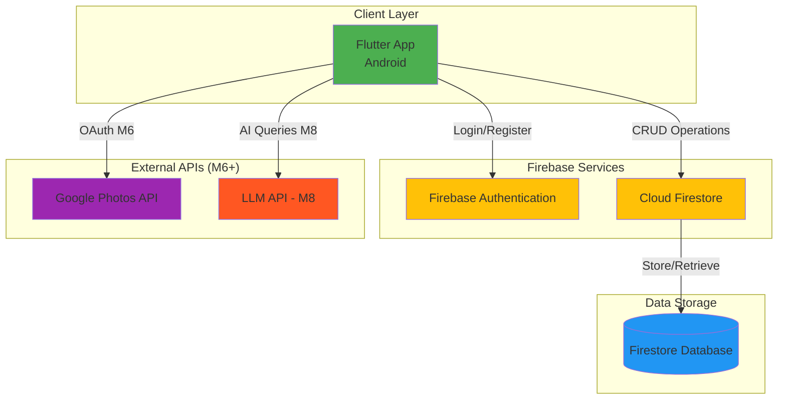
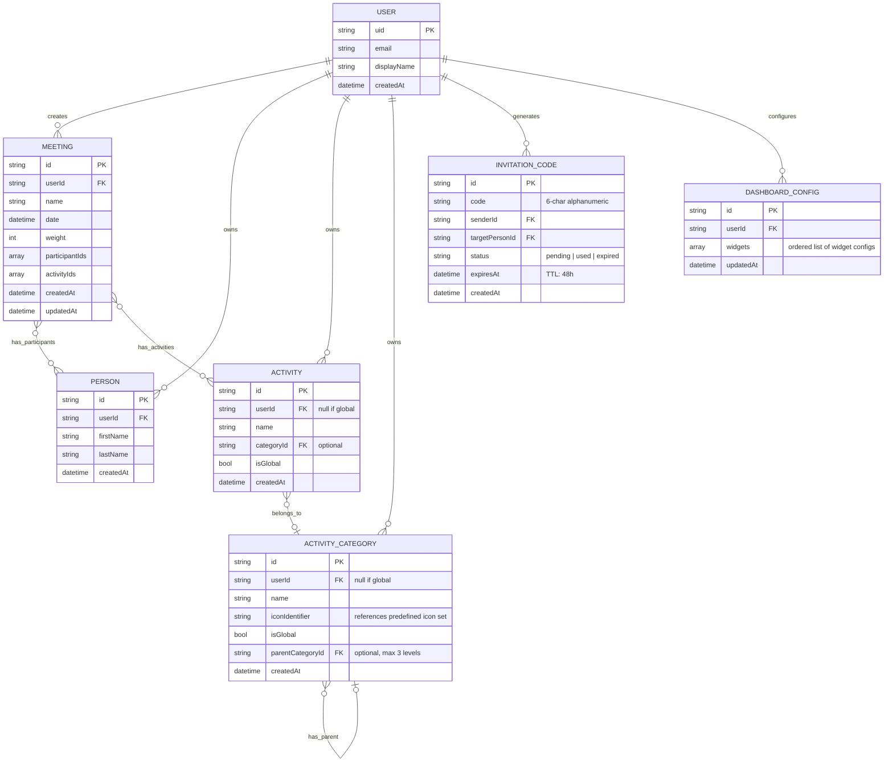
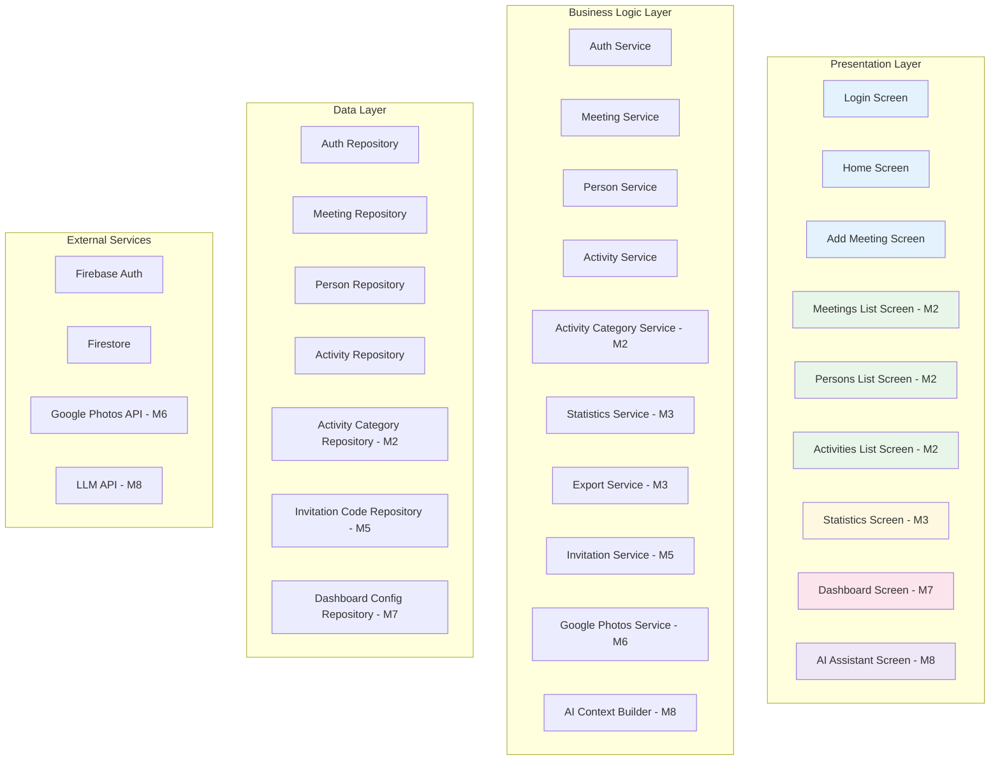
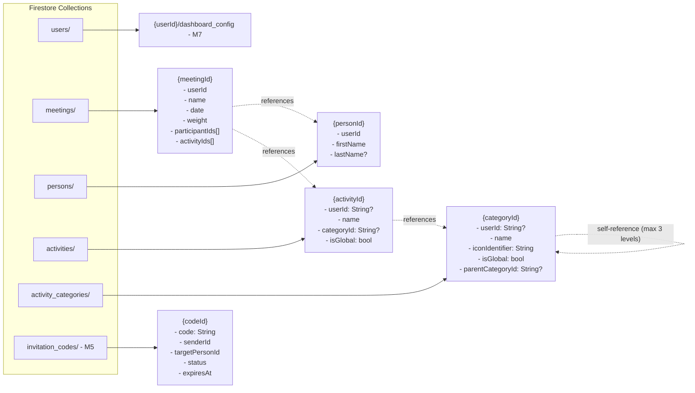
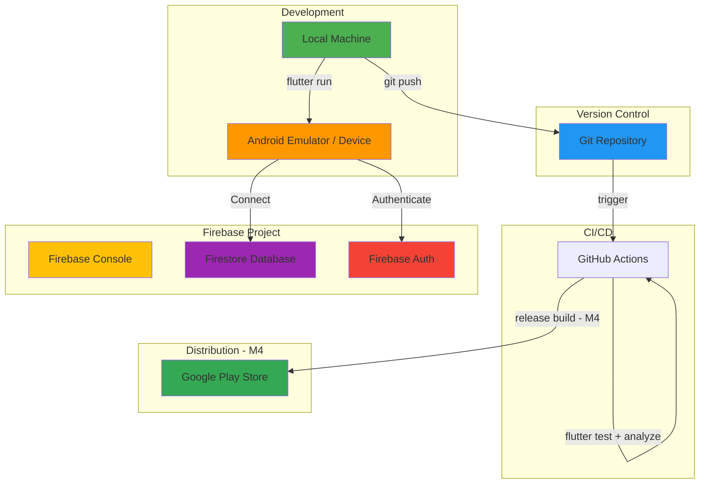

# Friendsheet - Architecture Documentation

## 1. Architecture Overview (High-Level)



**Responsible Role:** Solution Architect (SA)

---

## 2. Data Model - Entity Relationship Diagram (ERD)



**Responsible Role:** Solution Architect (SA) + Database Administrator (DBA)

---

## 3. Application Layer Architecture



**Architecture Pattern:** Clean Architecture / MVVM  
**Responsible Role:** Solution Architect (SA) + Tech Lead

---

## 4. Milestone Architecture Notes

### M2 — Activity Category Hierarchy

Activity categories support up to 3 levels of nesting via `parentCategoryId`:

```
Sport (level 1, isGlobal: true)
├── Kayaking (level 2, isGlobal: true)
└── Tennis (level 2, isGlobal: true)

Food & Drinks (level 1, isGlobal: true)
├── Restaurant (level 2, isGlobal: true)
└── Home Cooking (level 2, isGlobal: true)

My Custom Category (level 1, isGlobal: false, userId: uid)
└── My Subcategory (level 2, isGlobal: false, userId: uid)
```

**Icon System:** Icons stored as string identifiers (e.g. `"sports_tennis"`, `"kayaking"`) referencing Material Icons. Predefined set of ~50 icons. No image uploads — identifier resolved to widget at render time.

**Statistics implication:** Filtering by parent category includes all descendants. Query logic: load full category tree client-side, resolve descendant IDs, filter meetings.

---

### M3 — Statistics Architecture

Statistics are computed **client-side** in MVP (no Cloud Functions). This is acceptable for personal use scale (~800–5000 meetings).

**Performance consideration:** If queries become slow (>2s), introduce:
1. Composite Firestore indexes (isGlobal + categoryId)
2. Aggregation cache document updated on each meeting save
3. Cloud Functions for heavy computation (post-MVP upgrade path)

**Export:** JSON file written to device Downloads folder using `path_provider` + `dart:io`. No server-side processing required.

---

### M4 — Production Build

**Keystore management:**
- Keystore file: stored outside project directory, never committed
- `key.properties`: gitignored, contains keystore path and passwords
- CI/CD: keystore provided via GitHub Secrets for automated release builds

**New gitignore entries required:**
```
# Keystore
*.jks
*.keystore
key.properties
android/key.properties
```

---

### M5 — Social Data Sharing (Copy-Based, Option A)

**Decision:** Copy-based sharing chosen over real-time shared documents.

**Rationale:**
- Maintains existing data isolation model (no architectural changes to core)
- No Firestore cost risk from shared real-time listeners
- No conflict resolution logic needed
- Upgrade path to real-time sharing (Option B) possible without full rewrite

**Trade-off:** Data diverges after sharing. Person A editing a meeting after sharing will NOT update Person B's copy.

**Flow:**
```
Person A generates code
    → Firestore: invitation_codes/{code} created (TTL: 48h)
    
Person B redeems code
    → Validate: exists, not expired, not used
    → Query: meetings where participantIds contains targetPersonId
    → Batch write: copy meetings + persons + activities to B's Firestore
    → Deduplication: match persons/activities by name before creating new docs
    → Mark code as used
```

**New Firestore collection:** `invitation_codes`

```javascript
match /invitation_codes/{codeId} {
  // Anyone authenticated can read (needed to validate code)
  allow read: if isAuthenticated();
  // Only sender can create
  allow create: if isAuthenticated() && isOwner(request.resource.data.senderId);
  // Only recipient can update status to 'used'
  allow update: if isAuthenticated();
}
```

---

### M6 — Google Photos Integration

**OAuth Scope:** Separate from Firebase Auth. Requires additional user consent:
`https://www.googleapis.com/auth/photoslibrary.readonly`

**Token management:** Google Photos OAuth token managed separately from Firebase Auth token. Stored securely using `flutter_secure_storage`.

**Data flow:** Photo metadata (date) → pre-fill AddMeetingScreen. Photo itself is NOT stored in Firestore or app storage.

**UX consideration:** Permission request must clearly explain why photo access is needed. Android 13+ requires granular media permissions.

---

### M7 — Dashboard Configuration

**Storage:** Dashboard config stored in Firestore at `users/{uid}/dashboard_config` as a single document containing ordered widget list.

**Widget architecture:** Each dashboard widget is a self-contained Flutter widget that accepts a `DashboardWidgetConfig` object. Widget library is extensible — new widget types added without changing dashboard infrastructure.

---

### M8 — AI Assistant

**Status:** Architecture pending spike (US-040).

**Options under evaluation:**
- Claude API / OpenAI API — cloud-based, per-token cost, high quality
- Gemini Nano on-device — zero marginal cost, limited capability, no privacy concerns

**Privacy principle:** Raw Firestore data never sent to LLM. Only aggregated statistics summary sent as context. User must explicitly consent before first use.

---

## 5. Firestore Data Structure



**Global vs Private data pattern:**
- `isGlobal: true` + `userId: null` → managed via Firebase Console, read-only for all users
- `isGlobal: false` + `userId: String` → created and managed by individual user

---

## 6. Security Rules (Full)

```javascript
rules_version = '2';
service cloud.firestore {
  match /databases/{database}/documents {

    function isAuthenticated() {
      return request.auth != null;
    }

    function isOwner(userId) {
      return request.auth.uid == userId;
    }

    match /meetings/{meetingId} {
      allow read: if isAuthenticated() && isOwner(resource.data.userId);
      allow create: if isAuthenticated() && isOwner(request.resource.data.userId);
      allow update, delete: if isAuthenticated() && isOwner(resource.data.userId);
    }

    match /persons/{personId} {
      allow read: if isAuthenticated() && isOwner(resource.data.userId);
      allow create: if isAuthenticated() && isOwner(request.resource.data.userId);
      allow update, delete: if isAuthenticated() && isOwner(resource.data.userId);
    }

    match /activities/{activityId} {
      allow read: if isAuthenticated() &&
                    (resource.data.isGlobal == true || isOwner(resource.data.userId));
      allow create: if isAuthenticated() && isOwner(request.resource.data.userId);
      allow update, delete: if isAuthenticated() && isOwner(resource.data.userId);
    }

    match /activity_categories/{categoryId} {
      allow read: if isAuthenticated() &&
                    (resource.data.isGlobal == true || isOwner(resource.data.userId));
      allow create: if isAuthenticated() && isOwner(request.resource.data.userId);
      allow update, delete: if isAuthenticated() && isOwner(resource.data.userId);
    }

    // M5 - Invitation codes
    match /invitation_codes/{codeId} {
      allow read: if isAuthenticated();
      allow create: if isAuthenticated() && isOwner(request.resource.data.senderId);
      allow update: if isAuthenticated();
    }

    // M7 - Dashboard config (subcollection of users)
    match /users/{userId}/dashboard_config/{configId} {
      allow read, write: if isAuthenticated() && isOwner(userId);
    }
  }
}
```

---

## 7. Deployment Architecture



---

## 8. Technology Stack

### Current (M1)
- **Framework:** Flutter 3.0+ / Dart
- **State Management:** Provider
- **Database:** Cloud Firestore
- **Authentication:** Firebase Auth (Google Sign-In)
- **Models:** Freezed + json_serializable

### Planned Additions
| Milestone | Addition | Purpose |
|-----------|----------|---------|
| M2 | No new packages | Reuses existing stack |
| M3 | `path_provider`, `dart:io` | JSON export to device storage |
| M4 | Release signing config | Production build |
| M5 | No new packages | Firestore batch writes |
| M6 | `google_sign_in` (extended scope), `flutter_secure_storage`, Google Photos REST API | Photo OAuth + token storage |
| M7 | No new packages | Reuses existing stack |
| M8 | HTTP client (already available), LLM SDK TBD | AI API calls |

---

## 9. Scalability Considerations

### Current (Personal Use Scale)
- Client-side statistics aggregation
- Simple queries by userId
- Firestore free tier sufficient

### Post-MVP Upgrade Path
- **Statistics:** Cloud Functions for server-side aggregation
- **Social features:** Real-time shared documents (Option B) if copy-based insufficient
- **Caching:** Local statistics cache updated on meeting save
- **Indexes:** Composite indexes for category + isGlobal queries

---

**End of Document - Architecture Documentation**  
**Last Updated:** February 2026 (Full roadmap M1-M8)
