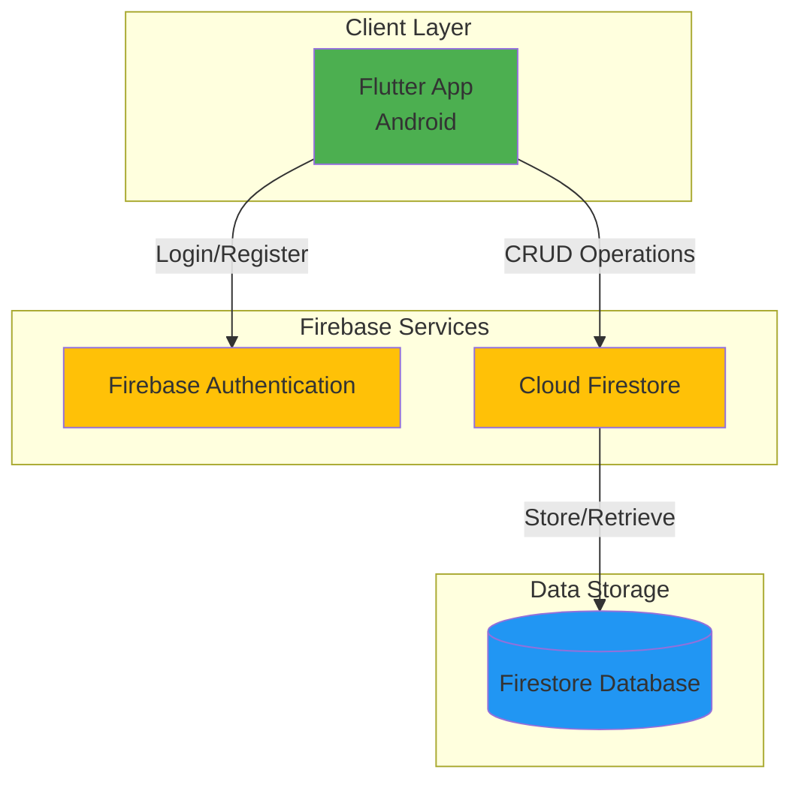
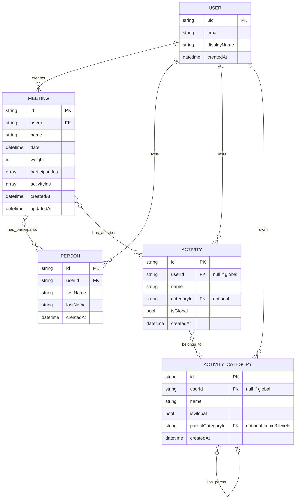
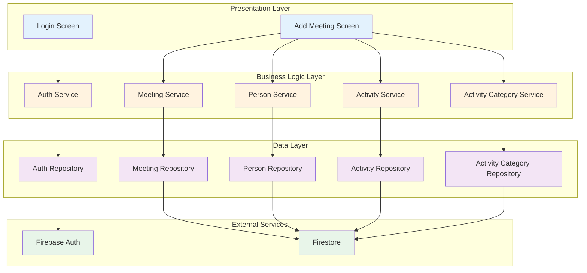
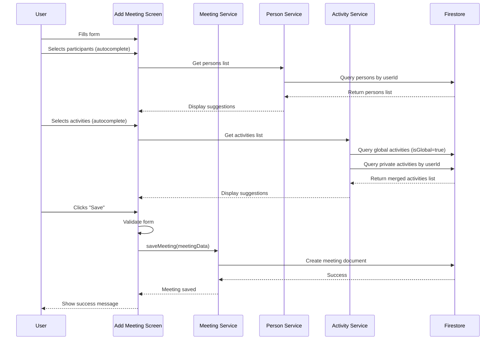
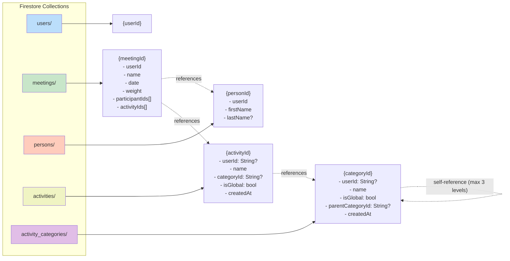
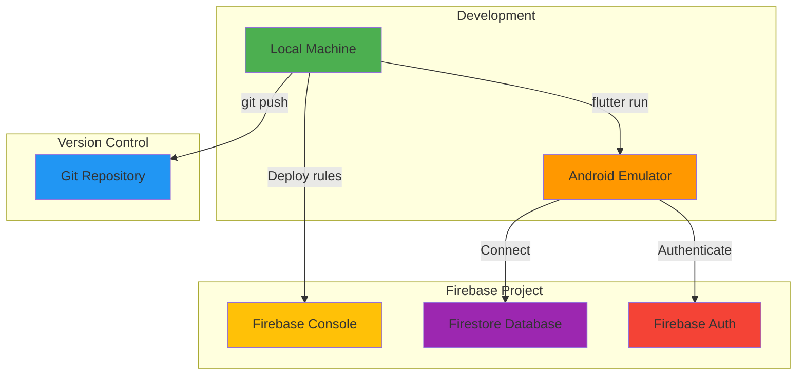
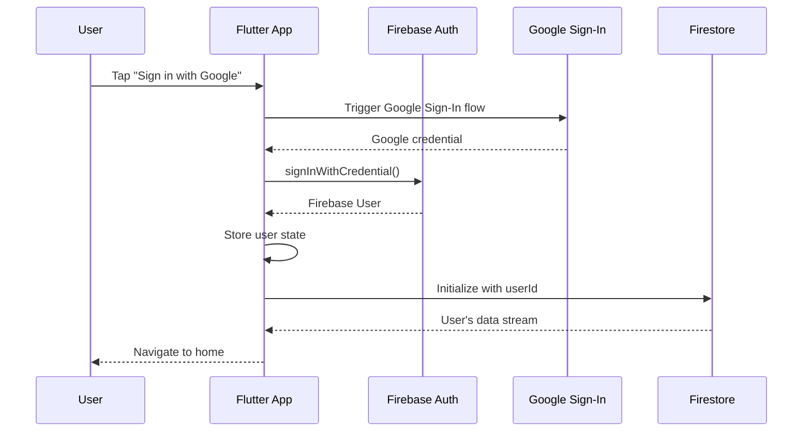

# Friendsheet - Architecture Documentation

## 1. Architecture Overview (High-Level)



**Responsible Role:** Solution Architect (SA)

---

## 2. Data Model - Entity Relationship Diagram (ERD)



**Responsible Role:** Solution Architect (SA) + Database Administrator (DBA)

---

## 3. Application Layer Architecture



**Architecture Pattern:** Clean Architecture / MVVM  
**Responsible Role:** Solution Architect (SA) + Tech Lead

**Layer Explanation:**
- **Presentation Layer** - Application screens (UI)
- **Business Logic Layer** - Business logic (Services)
- **Data Layer** - Data access (Repositories)
- **External Services** - External services (Firebase)

---

## 4. Add Meeting Screen - Component Flow



**Responsible Role:** Developer (Dev)

---

## 5. Firestore Data Structure



**Responsible Role:** Database Administrator (DBA) + Solution Architect (SA)

**Global vs Private data pattern:**
- `isGlobal: true` + `userId: null` → managed via Firebase Console, read-only for all users
- `isGlobal: false` + `userId: String` → created and managed by individual user

**Security Rules (Conceptual):**
```javascript
// Each user has access only to their own data.
// Global documents (isGlobal: true) are readable by all authenticated users.

match /meetings/{meetingId} {
  allow read, write: if request.auth.uid == resource.data.userId;
}

match /persons/{personId} {
  allow read, write: if request.auth.uid == resource.data.userId;
}

match /activities/{activityId} {
  // Global activities: read-only for all authenticated users
  allow read: if request.auth != null && resource.data.isGlobal == true;
  // Private activities: full access for owner only
  allow read, write: if request.auth.uid == resource.data.userId;
}

match /activity_categories/{categoryId} {
  // US-019: same pattern as activities
  allow read: if request.auth != null && resource.data.isGlobal == true;
  allow read, write: if request.auth.uid == resource.data.userId;
}
```

---

## 6. Deployment Architecture (Simple Schema)



**Responsible Role:** DevOps Engineer

---

## 7. Technology Stack Details

### Frontend
- **Framework:** Flutter 3.0+
- **Language:** Dart 2.17+
- **State Management:** Provider / Riverpod (TBD)
- **UI Components:** Material Design 3

### Backend
- **BaaS:** Firebase
  - **Authentication:** Firebase Auth (Google Sign-In)
  - **Database:** Cloud Firestore
  - **Hosting:** Firebase Hosting (web version - future)

### Development Tools
- **IDE:** Android Studio / VS Code
- **Version Control:** Git + GitHub
- **CI/CD:** GitHub Actions
- **Testing:** Flutter Test Framework

---

## 8. Design Patterns & Best Practices

### Architecture Pattern: Clean Architecture
```
lib/
├── core/                    # Core utilities, constants
├── data/                    # Data layer
│   ├── models/             # Data models
│   ├── repositories/       # Repository implementations
│   └── datasources/        # Firebase datasources
├── domain/                  # Business logic layer
│   ├── entities/           # Business entities
│   ├── repositories/       # Repository interfaces
│   └── usecases/           # Business use cases
├── presentation/            # Presentation layer
│   ├── screens/            # UI screens
│   ├── widgets/            # Reusable widgets
│   └── providers/          # State management
└── main.dart
```

### Key Principles
1. **Separation of Concerns** - Each layer has single responsibility
2. **Dependency Injection** - Dependencies injected via constructors
3. **Repository Pattern** - Abstract data access
4. **Single Source of Truth** - Firestore as primary data source
5. **Offline First** - Firestore persistence enabled

---

## 9. Security Architecture

### Authentication Flow


### Data Security
- **Authentication Required:** All Firestore operations require authenticated user
- **Row-Level Security:** Each document has `userId` field
- **Global Data:** Read-only for all authenticated users (`isGlobal: true`)
- **Security Rules:** Server-side validation in Firestore Rules
- **HTTPS Only:** All Firebase communication encrypted
- **No Sensitive Data:** Credentials managed by Google and Firebase Auth

---

## 10. Scalability Considerations

### Current MVP (Single User)
- Simple CRUD operations
- Basic queries by userId
- Global + private activities pattern
- Offline persistence

### Future Scalability (Post-MVP)
- **Statistics Generation:** Cloud Functions for heavy computation
- **Data Export:** Batch processing for large datasets
- **Caching:** Redis for frequently accessed data
- **Indexing:** Composite indexes for complex queries (e.g. isGlobal + categoryId)
- **Sharding:** User-based sharding if needed

---

**End of Document - Architecture Documentation**  
**Last Updated:** February 2026 (US-009 - Activity Model + Categories design)
