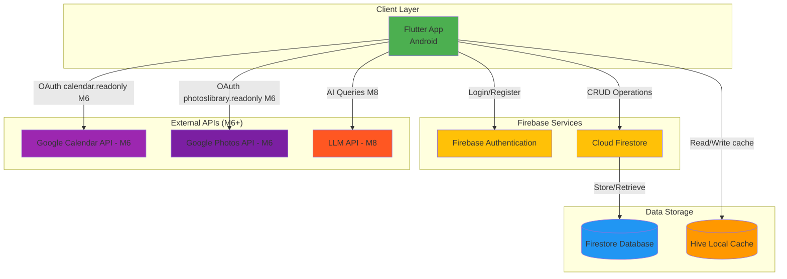
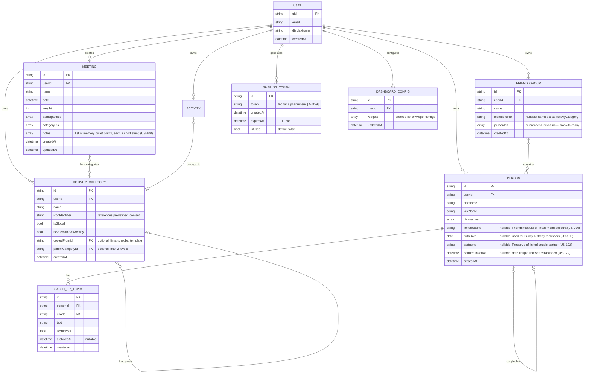
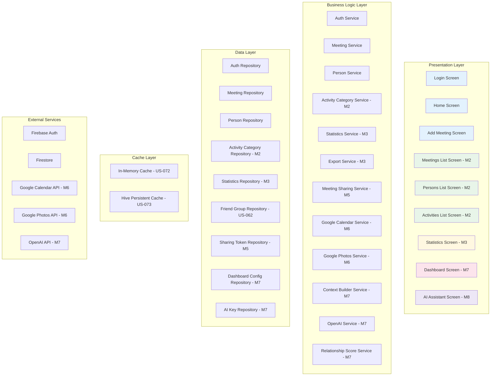
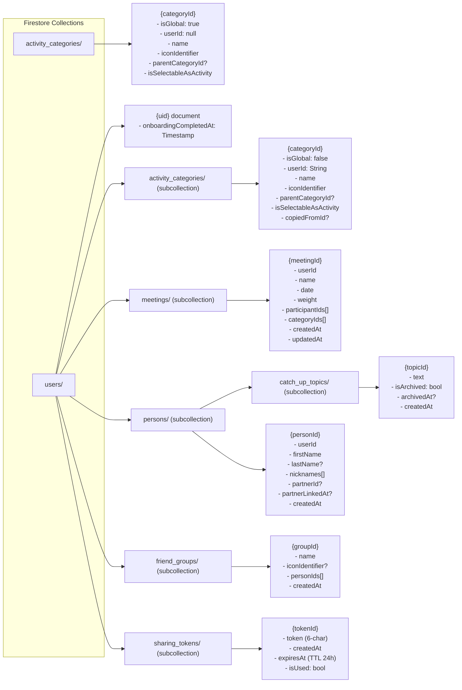
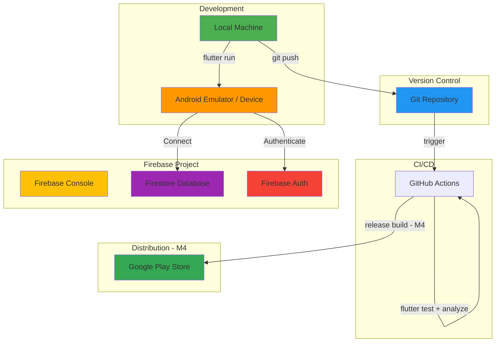

# Friendsheet - Architecture Documentation

## 1. Architecture Overview (High-Level)



**Responsible Role:** Solution Architect (SA)

---

## 2. Data Model - Entity Relationship Diagram (ERD)



**Responsible Role:** Solution Architect (SA) + Database Administrator (DBA)

---

## 3. Application Layer Architecture



**Architecture Pattern:** Clean Architecture / MVVM  
**Responsible Role:** Solution Architect (SA) + Tech Lead

---

## 4. Milestone Architecture Notes

### M2 — Navigation Architecture (US-021)

**Primary navigation pattern:** `BottomNavigationBar` with 4 tabs hosted in `MainScreen`.

**MainScreen** is the root widget returned by `AuthWrapper` after successful authentication. It owns the `BottomNavigationBar` and global FAB.

**Tab structure:**
| Index | Label | Screen | Status |
|-------|-------|--------|--------|
| 0 | Home | HomeScreen | ✅ US-065 |
| 1 | Meetings | MeetingsListScreen | ✅ US-021 |
| 2 | Friends | PersonsListScreen | ✅ US-024 |
| 3 | Activities | ActivitiesListScreen | ✅ US-026 |

**IndexedStack:** All tab widgets are kept alive — `MeetingsListScreen` stream subscription stays active when switching tabs.

**FAB:** Global `FloatingActionButton` in `MainScreen` navigates to `AddMeetingScreen` from any tab. After save, `Navigator.pop()` returns to originating tab.

**MeetingsListProvider pattern:**
- Extends `ChangeNotifier`
- Owns `StreamSubscription<List<Meeting>>` — cancelled in `dispose()`
- Groups meetings client-side by year (`Map<int, List<Meeting>>`)
- Auto-expands current year and previous year on `initialize()`

**Firestore indexes** managed via `firestore.indexes.json` (committed to repo). Deploy with:
```bash
firebase deploy --only firestore:indexes
```

---

### M2 — Activity Category Hierarchy

Activity categories support up to **2 levels** of nesting via `parentCategoryId`.
Users start with a copy of global categories (seeded during onboarding — US-020).
After onboarding, users see and manage only their own private categories.
```
Sport (level 1, isGlobal: false, userId: uid)
└── Tennis (level 2, isGlobal: false, userId: uid)

Food & Drinks (level 1, isGlobal: false, userId: uid)
└── Restaurant (level 2, isGlobal: false, userId: uid)
```

**Firestore path:** `users/{userId}/activity_categories` (subcollection)
Depth validation enforced in `ActivityCategoryRepository._validateDepth()`.

**Icon System:** PNG asset icons stored as string identifiers (e.g. `"sports_tennis"`) referencing a predefined set of 51 custom icons in `assets/icons/activities/`. Identifier resolved to asset path via `resolveActivityIcon()` helper in `activity_icons.dart`. Falls back to `Icons.category` if identifier unknown.

**Statistics implication:** Filtering by parent category includes all descendants. Query logic: load full category tree client-side, resolve descendant IDs, filter meetings.

**Onboarding copy logic:** On first login, all global categories are batch-copied to user's subcollection (US-020). Global categories are invisible to the user after onboarding.

---

### M2 — Activities List Screen (US-026)

**ActivitiesListProvider** owned by `MainScreen` — same lifecycle pattern as `PersonsListProvider`.
Initialized via `addPostFrameCallback` on first load and re-initialized on every tab switch to index 3.

**Data source:** `getAllCategories` reads only from `users/{userId}/activity_categories` subcollection. Root `activity_categories` collection is used only by `AuthService` during onboarding batch-copy — never queried from the UI layer.

**Edit/Delete guard:** Only categories with `isGlobal: false` expose long-press options.
Global categories are read-only in the UI.

---

### M3 — Statistics Architecture

Statistics are computed **client-side** in MVP (no Cloud Functions). This is acceptable for personal use scale (~800–5000 meetings).

**Performance consideration:** If queries become slow (>2s), introduce:
1. Composite Firestore indexes (isGlobal + categoryId)
2. Aggregation cache document updated on each meeting save
3. Cloud Functions for heavy computation (post-MVP upgrade path)

**ExportService** (`lib/data/services/export_service.dart`): fetches meetings,
persons and activityCategories for the authenticated user, serializes to JSON
and writes to `getExternalStorageDirectory()` (null-safe fallback to
`getApplicationDocumentsDirectory()`). Injectable `directoryProvider` parameter
enables test isolation without mocking platform channels.

**StatisticsRepository:** Separate from MeetingRepository. Dedicated queries:
- `getAvailableYears(userId)` — extracts unique years from meeting dates, sorted descending
- `getMeetingsForYear(userId, year)` — date-range query (Jan 1 → Jan 1 next year)

**StatisticsProvider:** Owned by `MainScreen` — same lifecycle pattern as `ActivitiesListProvider`.
Initialized via `addPostFrameCallback` on tab switch to index 0.
Persists `selectedYear` and `availableYears` during session.
`initialize()` is idempotent — guarded against concurrent calls.

**YearStepper:** Pure `StatelessWidget`. Receives `selectedYear`, `availableYears`, `onYearChanged` via constructor. No provider knowledge inside widget. Supports both arrow tap and swipe gesture.

**UI Decision:** Year selector implemented as YearStepper (`← YYYY →`) with horizontal swipe support. Arrows disabled at year boundaries.

**StatisticsRepository methods:**
- `getAvailableYears(userId)` — extracts unique years from meeting dates, sorted descending
- `getMeetingsForYear(userId, year)` — date-range query (Jan 1 → Jan 1 next year)
- `getActivityWeightBreakdown(userId, year)` — ancestor-aware weight aggregation per categoryId (US-028)
- `getPersonsForActivity(activityId, year, userId)` — weight per person for selected activity (US-029)
- `getInteractionDistribution(year, userId)` — yearly weight sum per person, two-year comparison (US-030)
- `getCumulativeInteractions(year, userId)` — cumulative weight sum per person up to selected year (US-030)

**Animated bar chart pattern (US-048, US-049):**
Use `_lastTargetLeft` / `_lastTargetBarHeight` fields (not `evaluate(controller)`) as tween begin values in `didUpdateWidget`. This guarantees stationary bars have `begin == end` regardless of controller timing or number of `didUpdateWidget` calls.

---

### M3.5 — Friend Groups Architecture (US-062)

**Overview:** Friends tab gains a grouped view. Groups are named buckets with an optional icon that hold references to existing `Person` IDs. A person can belong to multiple groups. Persons without a group appear in a non-collapsible "Ungrouped" section at the bottom of the Friends tab.

**Firestore path:** `users/{uid}/friend_groups/{groupId}`

**FriendGroup model:**
```dart
FriendGroup {
  id: string            // Firestore auto-generated
  name: string
  iconIdentifier: string?  // nullable, reuses same predefined set as ActivityCategory
  personIds: List<String>  // references to Person.id — many-to-many
  createdAt: DateTime?
}
```

**Repository cascade dependency:**
`PersonRepository` depends on `FriendGroupRepository`. When a person is deleted,
`deletePerson()` runs `removePersonFromMeetings` and `removePersonFromAllGroups`
in parallel via `Future.wait` before deleting the person document.

```dart
// PersonRepository.deletePerson cascade:
await Future.wait([
  _meetingRepository.removePersonFromMeetings(userId, personId),
  _friendGroupRepository.removePersonFromAllGroups(userId, personId),
]);
await _personsRef(userId).doc(personId).delete();
```

`removePersonFromAllGroups` uses `WriteBatch` — queries all groups containing `personId`
and removes it via `FieldValue.arrayRemove` in a single atomic operation.

**FriendGroupsProvider:** Owned by `MainScreen` alongside `PersonsListProvider`.
Reloaded on Friends tab tap (index == 2). Optimistic updates for `addPersonToGroup`
and `removePersonFromGroup` — updates local `_groups` list before Firestore call,
reverts via `loadGroups()` on error.

**Icon system reuse:** `iconIdentifier` uses the same string key format and the same
`activity_icons.dart` resolver (`resolveActivityIcon()`) as `ActivityCategory`.
No new icon assets introduced.

**PersonsListScreen layout (post US-062):**
```
ExpansionTile per FriendGroup (ordered by createdAt)
  └── PersonListTile per assigned person
─── Ungrouped ─────────────────────────────  ← always visible, non-collapsible
      PersonListTile (persons in no group)
```

**Group management entry points:**
- **[C-A]** From group row: `person_add` icon → `AssignPersonsBottomSheet` (multi-select)
- **[C-B]** From person: `PersonDetailScreen` → "Groups" section → `CheckboxListTile` per group

**Provider injection at call-site:**
`FriendGroupsProvider` is passed to `PersonDetailScreen` via `ChangeNotifierProvider.value`
at the navigation call-site in `PersonsListScreen`. `PersonDetailScreen` does not
instantiate providers internally.

---

### M4 — Production Build

**Status:** Signing config implemented (US-042)

**Keystore management:**
- Keystore file: stored outside project directory, never committed
- Location convention: one level above project root
- `key.properties`: gitignored, contains absolute keystore path and passwords
- `android/app/build.gradle.kts`: signing config loaded from key.properties (Kotlin DSL)
- CI/CD: keystore provided via GitHub Secrets for automated release builds (planned)

**New gitignore entries added:**
```
*.jks
*.keystore
key.properties
android/key.properties
```

---

### M5 — Social Data Sharing (Copy-Based, Peer-to-Peer)

**Decision:** Copy-based sharing chosen over real-time shared documents.

**Rationale:**
- Maintains existing data isolation model (no architectural changes to core)
- No Firestore cost risk from shared real-time listeners
- Upgrade path to real-time sharing possible without full rewrite

**Trade-off:** Data diverges after sharing. Person A editing a meeting after sharing will NOT update Person C's copy.

**Flow:**
```
Person C (new user) generates sharing token
    → Firestore: users/{C_uid}/sharing_tokens/{tokenId} (TTL: 24h, single-use)
    → C sends token to A out-of-band (WhatsApp, email, etc.)

Person A enters token in C's Person Detail screen
    → Validate: exists, not expired, not used
    → Person record for C gets linkedUserId = C's uid
    → Token marked as used

Person A selects meetings to share
    → Only meetings where C participated
    → Mandatory: date, weight, name, sender signature
    → Optional: other participants (firstName + lastName only, notes NEVER shared), activities
    → GDPR notice shown before confirm
    → Package batch-written to users/{C_uid}/pending_meetings/

Person C reviews package in Pending Meetings
    → Step 1: Resolve meeting date conflicts (same date = possible duplicate)
      → Options per conflict: merge / add as new / skip
    → Step 2: Resolve person name conflicts (same firstName + lastName)
      → Options: add with nickname / link to existing person
    → Step 3: Resolve activity name conflicts (same name, case-insensitive)
      → Options: rename / link to existing activity
    → Final confirm: batch write to C's Firestore subcollections
```

**New Firestore paths:**
- `users/{uid}/sharing_tokens/{tokenId}` — generated by recipient (C)
- `users/{uid}/pending_meetings/{packageId}` — written by sender (A), consumed by recipient (C)

**Person model extension:**
- `Person.linkedUserId: String?` — stores the Friendsheet uid of the linked friend account

**Security Rules:**
```javascript
// Sharing tokens — only token owner can read/write
match /users/{userId}/sharing_tokens/{tokenId} {
  allow read, write: if isAuthenticated() && isOwner(userId);
}

// Pending meetings — recipient reads, sender writes (must hold linkedUserId)
match /users/{userId}/pending_meetings/{packageId} {
  allow read, delete: if isAuthenticated() && isOwner(userId);
  allow create: if isAuthenticated(); // validated by linkedUserId check in service layer
}
```

**Navigation — Drawer "Sharing" section (new):**
- "Import from Calendar" (existing, moved under Sharing)
- "Share meetings with a friend" → GenerateSharingTokenScreen (new, US-089)
- Pending Meetings remains a separate drawer entry (not under Sharing)

**Privacy:**
- `Person.notes` is never included in shared packages
- Only `firstName` + `lastName` sent for participant records
- Sender must acknowledge GDPR notice before first send

---

### M6 — Meeting Import Hub

**Overview:** M6 introduces an extensible import system. Both import sources (Google Calendar and Google Photos) produce a list of `ImportCandidate` objects that flow into a shared, source-agnostic `MeetingInboxScreen`. This design allows new import sources to be added in future milestones by implementing only a new data-fetching layer — the inbox requires no changes.

**Import flow:**
```
External Source → ImportCandidate list (local memory) → MeetingInboxScreen → Firestore
```

**ImportCandidate model (local only — NOT persisted to Firestore):**
```dart
class ImportCandidate {
  final String id;          // local UUID, session-only
  final String title;       // pre-filled from event title (empty for photos)
  final DateTime date;      // from event start date or photo creation date
  final List<String> attendeeEmails;  // Calendar only; empty for Photos
  final ImportSourceType sourceType;  // calendar | photos
}
```

**MeetingInboxProvider:** holds `List<ImportCandidate>` with `SharedPreferences` persistence
(key: `meeting_inbox_candidates`). Candidates survive app restarts. Cleared on
`ImportSuccessScreen` CTA tap via `provider.clear()`.

---

**FEATURE-013: Google Calendar Import**

OAuth Scope: `https://www.googleapis.com/auth/calendar.readonly`

Token management: stored via `flutter_secure_storage`. Separate from Firebase Auth token.

Settings stored in SharedPreferences:
- `calendar_selected_ids`: List of selected calendar IDs (default: primary)
- `calendar_include_all_day`: bool (default: false)

Event filtering rules:
- Past events only (startTime < now)
- Minimum 2 attendees (organizer + at least 1 other)
- ALL-DAY events: excluded by default, included if `calendar_include_all_day: true`

Email-to-person heuristic: `firstname.lastname@domain` → parsed as `firstName: "Firstname", lastName: "Lastname"` — shown as suggestion, never auto-created.

---

**FEATURE-014: Google Photos Import**

OAuth Scope: `https://www.googleapis.com/auth/photoslibrary.readonly`

Token management: same `flutter_secure_storage` service as Calendar.

Data flow: photo creation date → `ImportCandidate.date`. Photo thumbnails displayed in grid for selection UX only — never stored.

Shares `MeetingInboxScreen` and `MeetingInboxProvider` with FEATURE-013 — no duplication. `sourceType: photos` on ImportCandidate allows inbox UI to adapt (e.g. no email suggestions for photos).

---

### M7 — Dashboard Configuration

**Storage:** Dashboard config stored in Firestore at `users/{uid}/dashboard_config` as a single document containing ordered widget list.

**Widget architecture:** Each dashboard widget is a self-contained Flutter widget that accepts a `DashboardWidgetConfig` object. Widget library is extensible — new widget types added without changing dashboard infrastructure.

---

### M7 (continued) — AI Assistant (Buddy)

**Status:** 🔄 In Progress — US-088 (API Key Management) ✅, US-085 (Consent Flow) ✅, US-086 (Context Builder) ✅, US-087 (AI Chat Screen) ✅, US-101 (HomeScreen Buddy Widget) ✅ delivered.

**Provider:** OpenAI GPT-4o — BYOK (user's own API key, no cost to developer).

**Privacy principle:** Real names pseudonymized on-device (Friend_A, Friend_B...) before every API call. Full meeting list with details sent as context — not raw Firestore data, but structured and anonymized. User must explicitly consent before first use.

**Write isolation principle:** Buddy never holds direct references to repositories. All reads flow through `ContextBuilderService`. All writes flow through `BuddyWriteService` which exposes exactly one method: `saveNotes(meetingId, notes)`. This prevents bulk data destruction regardless of user prompt content.

**Data flow:**
```
AIChatScreen
    ├── READ  → ContextBuilderService → repositories (read-only)
    └── WRITE → BuddyWriteService.saveNotes() → MeetingRepository (notes field only)
```

**Three interaction modes (US-087):**
- **Mode 1 — Meeting notes:** `AIChatScreen(meetingId: ...)` → `includeNotes: true` in context; Buddy collects notes and saves via `BuddyWriteService.saveNotes()`
- **Mode 2 — Friend context:** `AIChatScreen(personId: ...)` → `buildPersonContext()` used; Buddy shows friendship summary and personalised wishes
- **Mode 3 — Free query (default):** `buildFullContext()` without notes; Buddy answers social-history questions

**Key services:**
- `ContextBuilderService` ✅ — pseudonymization, per-person filtering, prompt serialization with `includeNotes` flag; computes `avgDaysBetweenMeetings` and `daysSinceLastMeeting` per person entry (US-105) (`lib/data/services/context_builder_service.dart`)
- `OpenAIService` ✅ — `openai_dart`-based streaming client; `_systemPrompt` includes meeting suggestion guidance: compare avg cadence vs elapsed time to surface overdue friends (US-105) (`lib/data/services/open_ai_service.dart`)
- `BuddyWriteService` ✅ — single write surface: `saveNotes(userId, meetingId, notes)` only (`lib/data/services/buddy_write_service.dart`)
- `LtnsExclusionService` ✅ — SharedPreferences-backed singleton; `getExcludedIds()` → `Set<String>`, `setExcluded(personId, bool)` persists immediately; key `buddy_ltns_excluded_ids` (US-118) (`lib/data/services/ltns_exclusion_service.dart`)
- `AIChatProvider` ✅ — ChangeNotifier managing chat session: `BuddyChatMode`-based initialization paths (`freeQuery`, `meetingNotes`, `meetingNotesList`, `birthdayList`, `birthdayWishes`, `lapsedFriendsList`, `lapsedFriendDetail`, `greeting`); LTNS labels show full name + frequency suffix (US-118); `_pendingActions` cleared on free-text send; `pendingActions: List<BuddyAction>?` for in-chat action buttons; `handleAction()` continues flow (`lib/presentation/ai_chat/ai_chat_provider.dart`)
- `BuddyWidgetProvider` ✅ — ChangeNotifier for HomeScreen floating widget; birthday detection (5-day urgency threshold); LTNS detection with `LtnsExclusionService` exclusion filter and `avgDaysBetweenMeetings` computation (US-118); exposes `urgentBirthdayPersons`, `daysUntilBirthday`, `upcomingBirthdayInfo`, `suggestedMeetings`, `lapsedPersons`, `isExpanded`; created and owned by `MainScreen` (`lib/presentation/providers/buddy_widget_provider.dart`)
- `BuddyWidget` ✅ — purely presentational floating widget; `Column([bubble, icon])` layout for correct hit-test bounds; 2-button layout: "💾 Save Your Memories" + birthday CTA variant; LTNS button; `_TailPainter` CustomPainter triangle (`lib/presentation/widgets/buddy_widget.dart`)
- `LtnsFilterScreen` ✅ — `StatefulWidget`; `SwitchListTile` per person backed by `LtnsExclusionService`; Polish-aware alphabetical sort; search bar; AppBar "Filtry LTNS"; navigated from `BuddyMenuScreen` via `MainScreen._openLtnsFilters()` (US-118) (`lib/presentation/screens/ltns_filter_screen.dart`)
- `birthday_format_helpers.dart` ✅ — pure functions: `formatBirthdayStats()`, `buildBirthdayListGreeting()`, `birthdayActionLabel()` (`lib/presentation/ai_chat/birthday_format_helpers.dart`)
- `LocalCacheService` ✅ — Hive-based full dataset cache (meetings, persons, activity_categories); exposes typed read methods for tool calling; write-through on every repository write (US-109) (`lib/data/services/local_cache_service.dart`)
- `ConnectivityService` 📋 — singleton with `ValueNotifier<ConnectivityStatus>`; drives offline banner and graceful degradation (US-111)
- `RelationshipScoreService` ✅ — local 0–100 scoring algorithm (frequency 35%, recency 30%, category variety 20%, weight variety 15%); reads exclusively from `LocalCacheService`, no API calls (US-107) (`lib/data/services/relationship_score_service.dart`)
- `AIKeyRepository` ✅ — Flutter Secure Storage wrapper for OpenAI key (`lib/data/repositories/ai_key_repository.dart`)

**New packages (US-087):**
- `openai_dart: ^2.0.0` — official Dart client for OpenAI API (streaming support)
- `flutter_markdown: ^0.7.7+1` — markdown rendering in `ChatBubble` for formatted Buddy responses

**Planned packages (US-111):**
- `connectivity_plus` — network connectivity detection for offline-first mode

**Error handling (typed exceptions):**
```dart
// lib/data/models/ai_exceptions.dart
AINetworkException   → retry button in chat UI
AIInvalidKeyException → link to AISettingsScreen
AIQuotaExceededException → link to OpenAI billing page
AIUnknownException   → generic error message
```

**Pseudonym back-translation:** `AIChatProvider` replaces `Friend_A`, `Friend_B`... with real names in displayed responses using `BuddyContext.pseudonymToRealName` map. Real names never leave the device in outbound requests.

**Gemini Nano (on-device):** deferred to future epic.

---

### M7 (continued) — Tool Calling Architecture (US-110)

**Decision (March 2026 discovery session):** Replace full-context upfront approach with OpenAI tool calling for historical and arbitrary date-range queries. Current `ContextBuilderService` approach (12-month window) retained for US-101–US-108 where applicable; tool calling added as a parallel path for deep queries.

**Tool calling data flow:**
```
User question
  → OpenAI API + tool definitions (JSON Schema)
    → tool_call: resolvePerson / getMeetingsByPersonAndYear / getMeetingsByDateRange / getPersonSummary
      → LocalCacheService (in-memory Hive data, no Firestore round-trip)
        → tool result returned to OpenAI
          → final response (pseudonyms back-translated before display)
```

**Tool definitions (4 tools):**
| Tool | Parameters | Purpose |
|---|---|---|
| `resolvePerson` | `query: String` | Match name/nickname → return pseudonym(s) or ambiguous |
| `getMeetingsByPersonAndYear` | `personAlias: String, year: int` | Filter meetings by participant + year |
| `getMeetingsByDateRange` | `startDate: String, endDate: String` | Filter meetings by date range |
| `getPersonSummary` | `personAlias: String` | Aggregate stats for a person |

**Pseudonymization in tool calling:** System prompt contains `[{alias: "Friend_A", firstName: "Gosia"}, ...]`. OpenAI resolves natural names to aliases in tool call parameters. App maps alias → personId at execution time. Firestore/cache never receives real names from OpenAI.

**Person disambiguation:** When `resolvePerson` returns `{status: "ambiguous", candidates: [...]}`, `AIChatProvider` enters `awaitingDisambiguation` state — streaming paused, native Flutter `DisambiguationBottomSheet` shown, pipeline resumed after user selection.

**Matching priority:** exact firstName → exact nickname → multiple matches → disambiguation

---

### M7 (continued) — Offline-First Architecture (US-109, US-111)

**Decision (March 2026 discovery session):** Hive chosen over Drift/SQLite. Max dataset ~5 MB (10,000 meetings × 500 B + 250 persons). In-memory filtering in Dart is sufficient at this scale — no SQL queries needed.

**Cache strategy:**
- **Sync on app start:** full load from Firestore → Hive (async, non-blocking)
- **Write-through:** every repository write updates Hive immediately; Firestore SDK queues offline writes and syncs on reconnect
- **User-scoped:** cache cleared on logout / account switch

**`LocalCacheService` read methods (used by tool calling and offline screens):**
```
resolvePerson(String query) → List<Person>
getMeetingsByPersonAndYear(String personPseudonym, int year) → List<Meeting>
getMeetingsByDateRange(DateTime start, DateTime end) → List<Meeting>
getPersonSummary(String personPseudonym) → PersonSummary
getAllPersons() → List<Person>
getMeetingNotes(String meetingId) → List<String>
```

**Offline writes:** Firestore SDK offline persistence is enabled by default on Flutter mobile. Write operations while offline are queued on-disk by the SDK and replayed automatically on reconnect. No custom write queue required.

**Offline UI indicators:**
- Offline banner: shown at top of screen when `ConnectivityService.isConnected == false`; auto-dismisses on reconnect
- Pending sync indicator: shown when Firestore has queued writes not yet confirmed

**Features available offline:**
- ✅ All read screens (meetings, persons, statistics, activities)
- ✅ Add / edit / delete meetings and persons (Firestore SDK queues)
- ❌ Buddy AI chat — disabled, message shown
- ❌ Google Calendar sync — disabled, message shown
- ❌ Google Sign-In on first launch — requires network

---

### M8 — Social Intelligence & Friends-Quest (EPIC-010)

**Status:** 📋 Planned (US-120 → US-127)

#### Catch-up Topics (US-120, US-121)

**Storage:** Firestore subcollection `users/{uid}/persons/{personId}/catch_up_topics/{topicId}` + Hive cache via `LocalCacheService`.

**Data model:**
- `CatchUpTopic`: id, text, isArchived, archivedAt?, createdAt

**Key services:**
- `CatchUpTopicRepository` — CRUD on Firestore subcollection + write-through to Hive
- `CatchUpTopicsProvider` — ChangeNotifier; load, add, archive, delete

**UI placement:** `PersonDetailScreen` — new `CatchUpListSection` below "Meetings together", above "Nicknames".

---

### RelationshipStrengthWidget (US-107)

`lib/presentation/persons/relationship_strength_widget.dart` — `StatelessWidget`; displays relationship score as a colored `LinearProgressIndicator` with score/100 and label.

Color scale: green (≥80), lightGreen (≥60), amber (≥40), orange (≥20), red (<20).

Score computed by `RelationshipScoreService.computeScore()` in `PersonDetailProvider.initialize()`; injected via `RelationshipScoreService` constructor param.

**UI placement:** `PersonDetailScreen` — first item in the `ListView` body, above meeting list.

---

#### Social Graph — Couple/Family Link (US-122, US-123)

**Storage:** `partnerId: String?` and `partnerLinkedAt: DateTime?` fields on `Person` model in Firestore + Hive.

**Write-through rule:** When a new `CatchUpTopic` is added for Person A and `Person.partnerId != null`, the same topic is written to Person B's subcollection automatically (inside `CatchUpTopicsProvider.addTopic()`).

**Deduplication rule:** A topic that exists on both linked persons is considered shared — displayed once in Friends-Quest, with `sourceTopicId` pointing to the canonical version.

**Separation rule:** Topics created BEFORE `partnerLinkedAt` → auto-return to original owner. Topics created AFTER `partnerLinkedAt` → redistribution dialog (Person A / Shared copy / Person B / Delete).

---

#### Friends-Quest (US-124, US-125, US-126)

**Storage:** Hive only — `friends_quests` box. NOT synced to Firestore. Quest pushes data to Firestore only at completion (via `MeetingRepository.addNotes()`).

**Data models (Hive):**
- `FriendsQuest`: id, name, participantIds, linkedMeetingId?, createdAt, isCompleted
- `FriendsQuestTask`: id, text, sourceTopicId?, assignedPersonIds, isCompleted

**Cardinality:** 1 quest : 1 meeting (max); 1 meeting : N quests (allowed).

**Task sync rules:**
- Edit task with `sourceTopicId` → propagates to original `CatchUpTopic` (and partner if couple-linked)
- Delete task with `sourceTopicId` → local removal only; `CatchUpTopic` NOT deleted
- Complete task with `sourceTopicId` → `CatchUpTopic.isArchived = true`

**UI entry points:** Side Menu tile + optional HomeScreen widget.

---

#### Buddy "Others" Integration (US-127)

**New Buddy chat mode:** `BuddyChatMode.catchUpTopics` — two sub-paths:
- Chat mode: display topics in-chat, no quest creation
- Friends-Quest mode: create or update a quest via natural conversation

**Person search:** firstName + lastName + all nicknames — shared utility across all Buddy scenarios.

**Write surface:** Buddy adds tasks to `FriendsQuestRepository` (Hive only) — not to Firestore directly. No extension of `BuddyWriteService` needed for Hive writes.

---

## 5. Firestore Data Structure



**Global vs Private data pattern:**
- Root `activity_categories/`: global template only (`isGlobal: true`, `userId: null`) — read-only for all users, managed via Firebase Console
- `users/{uid}/activity_categories/`: user's private copies (`isGlobal: false`, `userId: String`) — batch-copied from global on first login, fully editable by owner

**Rule:** Never query root `/meetings` or `/persons` — these collections do not exist post US-045.
All user data lives under `users/{uid}/` subcollections.

---

## 6. Security Rules (Full)

```javascript
rules_version = '2';
service cloud.firestore {
  match /databases/{database}/documents {

    function isAuthenticated() {
      return request.auth != null;
    }

    function isOwner(userId) {
      return request.auth.uid == userId;
    }

    match /activity_categories/{categoryId} {
      allow read: if isAuthenticated() && resource.data.isGlobal == true;
      allow create: if isAuthenticated() &&
                       request.resource.data.isGlobal == false &&
                       isOwner(request.resource.data.userId);
    }

    match /users/{userId} {
      allow read, write: if isAuthenticated() && isOwner(userId);
    }

    match /users/{userId}/activity_categories/{categoryId} {
      allow read, delete: if isAuthenticated() && isOwner(userId);
      allow create, update: if isAuthenticated() && isOwner(userId);
    }

    match /users/{userId}/meetings/{meetingId} {
      allow read, delete: if isAuthenticated() && isOwner(userId);
      allow create, update: if isAuthenticated() && isOwner(userId);
    }

    match /users/{userId}/persons/{personId} {
      allow read, delete: if isAuthenticated() && isOwner(userId);
      allow create, update: if isAuthenticated() && isOwner(userId);
    }

    match /users/{userId}/friend_groups/{groupId} {
      // Path-based userId check — required for list queries (resource.data unavailable)
      allow read: if isAuthenticated() && isOwner(userId);
      allow create: if isAuthenticated() && isOwner(userId);
      allow update: if isAuthenticated() && isOwner(userId);
      allow delete: if isAuthenticated() && isOwner(userId);
    }

    match /users/{userId}/sharing_tokens/{tokenId} {
      // Path-based userId check — required for list queries (resource.data unavailable)
      allow read, write: if isAuthenticated() && isOwner(userId);
    }

    // Collection group rule — allows any authenticated user to look up a token
    // by value across all users' sharing_tokens subcollections (US-090 validation).
    // Targeted update: only the isUsed false→true transition is allowed;
    // all other fields must remain unchanged to prevent tampering.
    match /{path=**}/sharing_tokens/{tokenId} {
      allow read: if isAuthenticated();
      allow update: if isAuthenticated()
                    && resource.data.isUsed == false
                    && request.resource.data.isUsed == true
                    && request.resource.data.token == resource.data.token
                    && request.resource.data.createdAt == resource.data.createdAt
                    && request.resource.data.expiresAt == resource.data.expiresAt;
    }

    match /users/{userId}/pending_meetings/{packageId} {
      // Recipient reads/deletes their own packages; sender writes (linkedUserId validated in service)
      allow read, delete: if isAuthenticated() && isOwner(userId);
      allow create: if isAuthenticated();
    }

    match /users/{userId}/dashboard_config/{configId} {
      allow read, write: if isAuthenticated() && isOwner(userId);
    }
  }
}
```

---

## 7. Deployment Architecture



---

## 8. Technology Stack

### Current (M1)
- **Framework:** Flutter 3.0+ / Dart
- **State Management:** Provider
- **Database:** Cloud Firestore
- **Authentication:** Firebase Auth (Google Sign-In)
- **Models:** Freezed + json_serializable

### Planned Additions
| Milestone | Addition | Purpose |
|-----------|----------|---------|
| M2 | No new packages | Reuses existing stack |
| M3 | `path_provider`, `dart:io` ✅ | JSON export to device storage |
| M3.5 / US-072–073 | `hive`, `hive_flutter` ✅ | Persistent local cache for offline-first statistics |
| M4 | Release signing config | Production build |
| M5 | No new packages | Firestore batch writes |
| M6 (FEATURE-013) | `google_sign_in` (extended scope: `calendar.readonly`) ✅ | Calendar OAuth |
| M6 (FEATURE-013) | `flutter_secure_storage` ✅ | OAuth token storage |
| M6 (FEATURE-013) | Google Calendar REST API (via `http`) ✅ | Fetch calendar events |
| M6 (FEATURE-014) | `google_sign_in` (extended scope: `photoslibrary.readonly`) | Photos OAuth |
| M6 (FEATURE-014) | Google Photos REST API (via `http`) | Fetch photo metadata |
| M7 | No new packages | Reuses existing stack |
| M8 | HTTP client (already available), LLM SDK TBD | AI API calls |

---

## 9. Scalability Considerations

### Current (Personal Use Scale)
- Client-side statistics aggregation
- Simple queries by userId
- Firestore free tier sufficient

### Post-MVP Upgrade Path
- **Statistics:** Cloud Functions for server-side aggregation
- **Social features:** Real-time shared documents (Option B) if copy-based insufficient
- **Caching:** TTL-based Hive cache expiration (deferred — single user, infrequent writes)
- **Indexes:** Composite indexes for category + isGlobal queries

---

## Statistics Caching Strategy (US-072, US-073)

### Problem

Each `StatisticsProvider.initialize()` call previously triggered multiple redundant Firestore reads:
the same year's meetings, categories, and persons were fetched independently by each of
`getActivityWeightBreakdown`, `getPersonsForActivity`, and `getInteractionDistribution`.
Additionally, every app restart cleared all cached data and triggered ~1,800 Firestore reads
on first statistics open.

### Three-Phase Solution (US-072) + Persistent Layer (US-073)

**Phase 1 — Provider-level idempotency guard**

`StatisticsProvider` tracks `_isInitialized` and `_lastLoadedYear`. A second `initialize()` call
with the same year is a no-op. `selectYear()` with the same year is also a no-op. `resetCache()`
clears the guard for logout/user-switch scenarios.

**Phase 2 — Repository-level in-memory cache**

`StatisticsRepository` caches:
- `_meetingsCache: Map<String, List<Meeting>>` keyed by `'${userId}_${year}'`
- `_categoriesCache: List<ActivityCategory>?` (single user)
- `_personsCache: List<Person>?` (single user)

Cache invalidation is wired via the `CacheInvalidator` interface (implemented by
`StatisticsRepository`, consumed by `MeetingRepository`, `PersonRepository`,
and `ActivityCategoryRepository`). All `invalidate*Cache()` methods are `Future<void>` —
write operations `await` them so stale data is never served after a mutation.

**Phase 3 — Single-query refactor via StatsDataBundle**

`StatsDataBundle` (plain Dart class, no Freezed) bundles all data for one year's statistics:

```dart
class StatsDataBundle {
  final List<Meeting> currentYearMeetings;
  final List<Meeting> previousYearMeetings;
  final List<ActivityCategory> categories;
  final List<Person> persons;
}
```

`StatisticsRepository.loadAllStatsData(year, userId)` fetches all four in parallel via
`Future.wait`, using caches where available. The result is stored on `StatisticsProvider`
as `_currentBundle` and reused by:

- `computeActivityBreakdown(bundle)` — synchronous, no Firestore
- `computePersonsForActivity(bundle, categoryId)` — synchronous, no Firestore
- `computeInteractionDistribution(bundle)` — synchronous, no Firestore

`selectActivity()` and yearly-mode `loadDistribution()` use the stored bundle —
zero additional Firestore reads. Only cumulative mode (`getCumulativeInteractions`)
and `getAvailableYears` still require their own queries.

### Persistent Cache Layer (US-073)

**Problem:** In-memory cache (US-072) is cleared on every app restart, triggering
~1,800 Firestore reads on first statistics open after relaunch.

**Solution:** Hive persistent cache as a second cache layer below in-memory.

**Lookup chain:**
1. In-memory cache (US-072) — fastest, session-only
2. Hive disk cache (US-073) — fast, survives restarts
3. Firestore — only on true cache miss (first ever load)

**Hive box structure:**

| Box name | Key | Value |
|---|---|---|
| `stats_meetings` | `{userId}_{year}` | `List<Meeting>` as JSON |
| `stats_categories` | `{userId}` | `List<ActivityCategory>` as JSON |
| `stats_persons` | `{userId}` | `List<Person>` as JSON |
| `stats_available_years` | `{userId}` | `List<int>` |

**Adapter strategy: JSON bridge (Option B)**
Existing `toJson()`/`fromJson()` methods used for serialization.
No `@HiveType`/`@HiveField` annotations on Freezed models — avoids build_runner conflicts.

**HiveService** (`lib/services/hive_service.dart`): opens all boxes once at app startup
in `main.dart` before `runApp()`. `clearUserData(userId)` removes all cache entries
for a given user — called on logout from `AuthService`.

**Cache invalidation:** All `invalidate*Cache()` methods in `StatisticsRepository`
are `Future<void>` and clear both in-memory and Hive layers atomically.
`CacheInvalidator` interface methods are `Future<void>` accordingly.

### Combined Result

| Operation | Before US-072 | After US-072 | After US-073 |
|---|---|---|---|
| First initialize() | ~10+ queries | 1 (years) + 4 (bundle) | 1 (years) + 4 (bundle) |
| selectYear() (new year) | ~8 queries | 2 (cached) | ~0 (if Hive hit) |
| selectActivity() | 2 queries | 0 | 0 |
| loadDistribution() (yearly) | 3 queries | 0 | 0 |
| Second initialize() (same tab) | ~10+ | 0 (provider guard) | 0 |
| App restart, no writes | ~10+ | ~5 (cache cleared) | ~0 (Hive hit) |

---

### M5 — Calendar Import Architecture (US-065, US-066)

**HomeProvider** subscribes to `MeetingRepository.getMeetingsByUser()` stream —
same real-time listener pattern as `MeetingsListProvider`.

`shouldShowCta` getter: `_initialized && _meetingCount < 50`

The `_initialized` flag prevents CTA card flash on startup — `shouldShowCta` returns
`false` until the first stream emission sets `_initialized = true`. Before that,
`HomeScreen` renders `HomeLoadingScreen` with `assets/images/loading_icon.png`.

CTA card has **no dismiss button** — it disappears only when meeting count reaches 50.
(FR-020 final spec removed dismiss — `isDismissed` / `onboarding_calendar_cta_dismissed`
key no longer used.)

**GoogleCalendarService** (Singleton) uses incremental OAuth via `google_sign_in.requestScopes()`.
Access token stored in `flutter_secure_storage` (key: `google_calendar_access_token`).
Does NOT create a new GoogleSignIn instance — reuses existing session.

**CalendarSettingsProvider** owned by `MainScreen` — same lifecycle pattern as other providers.
Calendar selection and ALL-DAY preference persisted in SharedPreferences:
- `calendar_selected_ids` — JSON-encoded list
- `calendar_include_all_day` — bool (default: false)

**CalendarPermissionScreen** navigation:
- Entry: MainScreen Drawer → "Import from Calendar"
- On grant: `Navigator.pushReplacement` → SettingsScreen (calendar section visible)
- On deny: error message shown inline, retry available

---

### M5 — Meeting Inbox Architecture (US-068)

**MeetingInboxProvider** owned by `MainScreen` — same lifecycle as
`CalendarSettingsProvider`. Initialized via `loadFromPrefs()` in
`addPostFrameCallback`.

**Persistence:** `SharedPreferences` key `meeting_inbox_candidates` —
`List<ImportCandidate>` serialized as JSON. Candidates survive app restarts.
Cleared on `ImportSuccessScreen` CTA tap via `provider.clear()`.

**Navigation scope rule:** Every `Navigator.push` to `MeetingInboxScreen`
or `CalendarEventsScreen` must wrap the child in
`ChangeNotifierProvider.value(value: _meetingInboxProvider)` — new routes
do not inherit providers from `MainScreen` automatically.

**Source-agnostic design:** Both Calendar (US-067) and Photos (US-070)
call `addCandidates()` on the same `MeetingInboxProvider`. Adding a new
import source requires only a new data-fetching layer.

---

---

### M5 — Link Friend Account Architecture (US-090)

**Purpose:** Allows user A to link a Person record to another Friendsheet user (C) by entering C's sharing token. Once linked, `Person.linkedUserId` stores C's uid, enabling future meeting sharing flows (US-091+).

**Person model extension:**

`Person.linkedUserId: String?` — nullable field added in US-090. Null until A successfully enters and validates C's token. After linking, contains C's Firebase uid. Persisted to `users/{A_uid}/persons/{personId}` via `PersonRepository.updatePerson()`.

**Token validation flow:**

```
User A enters 6-char token in PersonDetailScreen dialog
    → SharingTokenRepository.validateAndClaimToken(token, linkedPersonId)
    → Collection group query: collectionGroup('sharing_tokens').where('token', ==, value)
    → Validate: document exists, expiresAt > now, isUsed == false
    → On valid: call markAsUsed(docRef) — targeted update (isUsed false→true only)
    → Call PersonRepository.updatePerson() with linkedUserId = tokenDoc owner uid
    → Return TokenValidationResult (success | TokenValidationError enum value)
```

**Collection group query pattern:**

`SharingTokenRepository.validateAndClaimToken()` uses `FirebaseFirestore.instance.collectionGroup('sharing_tokens')` to search across all users' token subcollections by token string. This avoids storing tokens in a root collection while enabling cross-user lookup. Requires a collection group index in `firestore.indexes.json`.

**fieldOverrides pattern for collection group index:**

When a field used in a collection group index appears in documents that also have other indexed fields, Firestore may auto-generate unwanted ascending/descending indexes. Use `fieldOverrides` with `queryScope: COLLECTION_GROUP` and empty `indexes: []` to suppress default behavior:

```json
{
  "collectionGroup": "sharing_tokens",
  "fieldOverrides": [
    {
      "fieldPath": "token",
      "indexes": [],
      "queryScope": "COLLECTION_GROUP"
    }
  ]
}
```

This exempts the `token` field from default index generation while the explicit collection group index (defined in the `indexes` array) remains active.

**Targeted Firestore update rule (isUsed false→true only):**

The collection group rule for `sharing_tokens` restricts updates to the single `isUsed` flag transition. All other fields must match their current values — this prevents a malicious caller from modifying `token`, `expiresAt`, or other fields through the collection group path:

```javascript
// WRONG — allows any authenticated user to overwrite any field:
allow update: if isAuthenticated();

// CORRECT — only the isUsed false→true transition is permitted:
allow update: if isAuthenticated()
              && resource.data.isUsed == false
              && request.resource.data.isUsed == true
              && request.resource.data.token == resource.data.token
              && request.resource.data.createdAt == resource.data.createdAt
              && request.resource.data.expiresAt == resource.data.expiresAt;
```

**TokenValidationResult sealed result type:**

`SharingTokenRepository.validateAndClaimToken()` returns a `TokenValidationResult` — a sealed result class rather than throwing exceptions. The caller (`PersonDetailProvider.linkFriendAccount()`) switches on the result to display the appropriate error message in the UI without try/catch at the provider layer.

---

### M5 — Share Meetings Architecture (US-091)

**Purpose:** Allows user A to select meetings where linked friend C participated and send them as a package to C's `pending_meetings` Firestore subcollection.

**New files:**
- `lib/data/models/pending_meeting_package.dart` — three Freezed types: `PendingMeetingPackage`, `SharedMeeting`, `SharedPerson`
- `lib/data/services/meeting_package_service.dart` — writes package to `users/{C_uid}/pending_meetings/`
- `lib/presentation/sharing/share_meetings_provider.dart` — loading, selection, send orchestration
- `lib/presentation/sharing/share_meetings_screen.dart` — UI: sender signature, meeting list, options, GDPR dialog

**Data model written to Firestore:**

```
users/{C_uid}/pending_meetings/{packageId}
  senderUid: String
  senderFirstName: String
  senderLastName: String
  senderNickname: String?         — optional
  sentAt: Timestamp
  meetings: [
    {
      name: String,
      date: Timestamp,
      weight: int,
      participants: [{firstName, lastName}],   — empty if includePersons=false
      categoryNames: [String]                  — empty if includeActivities=false
    }
  ]
```

**Privacy constraint — SharedPerson:**

Only `firstName` and `lastName` are sent. Nicknames, notes, and any other Person fields are never included. The target person (C = `targetPersonId`) is excluded from the participants list to avoid sending C's own data back to C.

**getMeetingsByParticipant — no composite index:**

`MeetingRepository.getMeetingsByParticipant()` uses `arrayContains` on `participantIds` without `orderBy` to avoid requiring a composite Firestore index. Sorting is done client-side after the query returns.

**Provider injection at call-site (ShareMeetingsProvider):**

`ShareMeetingsProvider` is created in `_PersonDetailScreenState._openShareMeetingsScreen()` and passed into the new route via `ChangeNotifierProvider.value`. This follows the Provider Scope Rule — the pushed route receives its own `BuildContext` that does not inherit providers from the parent route.

**Firestore Security Rule:**

```javascript
match /users/{userId}/pending_meetings/{packageId} {
  allow read, delete: if isAuthenticated() && isOwner(userId);
  allow create: if isAuthenticated(); // linkedUserId validated in service layer
}
```

---

### M5 — Receive Package & Resolve Duplicates Architecture (US-092)

**Purpose:** Allows user C to view received `PendingMeetingPackage` documents from `pending_meetings/`, detect date conflicts with their existing meetings, resolve each conflict individually, and proceed to US-093 for final import.

**New files:**
- `lib/data/repositories/pending_meeting_package_repository.dart` — `fetchPackages(userId)` and `deletePackage(userId, packageId)` against `users/{uid}/pending_meetings/`
- `lib/presentation/providers/shared_package_inbox_provider.dart` — conflict detection, resolution state, `canProceed` gate
- `lib/presentation/import/package_conflict_screen.dart` — per-package review screen with side-by-side conflict cards

**Modified files:**
- `lib/presentation/import/meeting_inbox_screen.dart` — added shared packages section above calendar candidates; empty-state and success-screen guards updated
- `lib/presentation/screens/main_screen.dart` — `SharedPackageInboxProvider` created and initialized; drawer tile uses `Consumer2` for combined count

**Conflict detection:**

Date comparison is date-only (year + month + day). Time-of-day is ignored. Detection runs once during `initialize()` using a one-time snapshot (`getMeetingsByUser(userId).first`). Result stored in `_conflicts: Map<String, Map<int, Meeting>>` keyed by `packageId → meetingIndex`.

**ConflictResolution enum:**

```dart
enum ConflictResolution { merge, addAsNew, skip }
```

Resolution state stored in `_resolutions: Map<String, Map<int, ConflictResolution>>`. The `canProceed(packageId)` method gates the Continue button: returns `true` only when every conflict index has a resolution.

**dismissPackage — local-only:**

`dismissPackage(packageId)` removes the package from local state only. It does NOT delete the Firestore document. US-093 handles final import and `deletePackage()` call.

**Provider lifecycle:**

`SharedPackageInboxProvider` is owned by `MainScreen` (same lifecycle as `MeetingInboxProvider`). Passed into `MeetingInboxScreen` and `PackageConflictScreen` routes via `ChangeNotifierProvider.value` at the call-site — follows the Provider Scope Rule.

---

### M5 — Conflict Resolution: Persons & Activities Architecture (US-093)

**Purpose:** After meeting date conflicts are resolved in `PackageConflictScreen`, the import flow continues through optional activity and person review screens, then performs a final batch import to Firestore.

**New files:**
- `lib/presentation/import/package_activities_screen.dart` — step 2a: resolve activity name conflicts (rename or link) and opt out of individual activities via `CheckboxListTile`
- `lib/presentation/import/package_persons_screen.dart` — step 2b: resolve person name conflicts (nickname or link) and opt out of persons via `SwitchListTile` with strikethrough
- `lib/presentation/import/package_conflict_screen_tiles.dart` — part file for `PackageConflictScreen` tile widgets (300-line limit split)
- `lib/presentation/providers/package_importer.dart` — stateless `PackageImporter` class; performs batch Firestore writes for meetings, persons, and activity categories
- `lib/presentation/providers/package_import_types.dart` — `ActivityResolution`, `PersonResolution`, `ImportSummary` value types

**Modified files:**
- `lib/presentation/providers/shared_package_inbox_provider.dart` — activity/person conflict detection, `canProceedActivities`, `canProceedPersons`, opt-out and resolution state maps; sender always added to `_uniquePersons`
- `lib/presentation/import/package_conflict_screen.dart` — converted to `StatefulWidget`; `_onContinue` skips screens with no conflicts; imports directly if neither conflicts exist
- `lib/presentation/import/share_import_success_screen.dart` — `_onDone` uses `popUntil(ModalRoute.withName('/meeting_inbox'))` to handle variable navigation depth
- `lib/presentation/screens/main_screen.dart` — `_openPendingMeetings` route now includes `RouteSettings(name: '/meeting_inbox')` for named-route pop

**Navigation flow:**

```
PackageConflictScreen
  → has activity conflicts?  YES → PackageActivitiesScreen
                                     → has person conflicts? YES → PackagePersonsScreen → import → SuccessScreen
                                                            NO  → import → SuccessScreen
  → has activity conflicts?  NO
  → has person conflicts?    YES → PackagePersonsScreen → import → SuccessScreen
  → neither                  NO  → import → SuccessScreen (direct, no extra screens)
```

**Named route pattern:**

`MeetingInboxScreen` is pushed with `RouteSettings(name: '/meeting_inbox')`. `ShareImportSuccessScreen._onDone` calls `popUntil(ModalRoute.withName('/meeting_inbox'))` — works regardless of import depth (1, 2, or 3 screens deep).

**PackageImporter:**

Stateless helper injected with `MeetingRepository`, `PersonRepository`, `ActivityCategoryRepository`. Accepts all resolution and opt-out maps from the provider and performs:
1. Filter meeting indices (skip merge/skip resolutions)
2. Build `categoryName → categoryId` map (create new or link existing)
3. Build `personKey → personId` map — sender always included unconditionally
4. Save each meeting with resolved `participantIds` (includes sender) and `categoryIds`

**Sender-as-participant rule:**

The sender is always added to `_uniquePersons` during `_detectPersonActivityConflicts` in the provider, and always added to `personsToImport` in `PackageImporter._buildPersonMap`. Their person ID is injected into every imported meeting's `participantIds` using Set deduplication.

---

**End of Document - Architecture Documentation**

**Last Updated:** March 2026 (US-093 Conflict Resolution Persons & Activities — PackageActivitiesScreen, PackagePersonsScreen, PackageImporter, package_import_types, share_import_success_screen popUntil, named route /meeting_inbox)