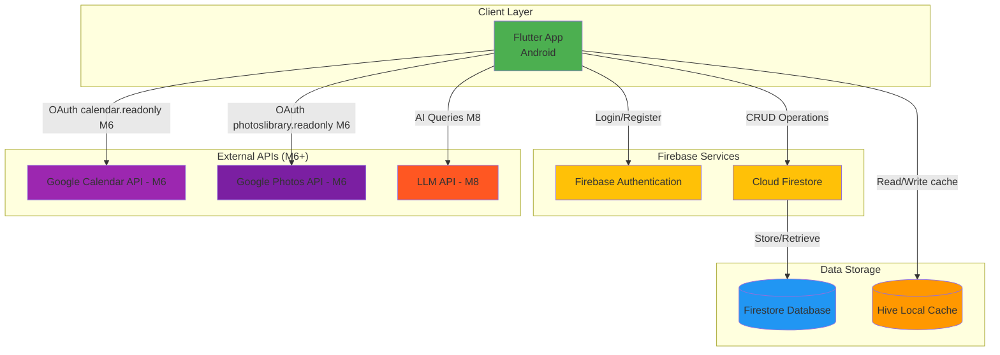
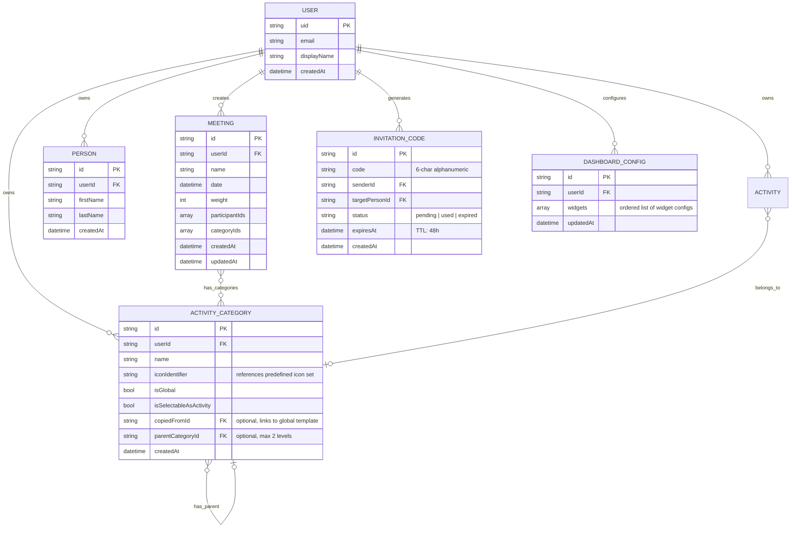
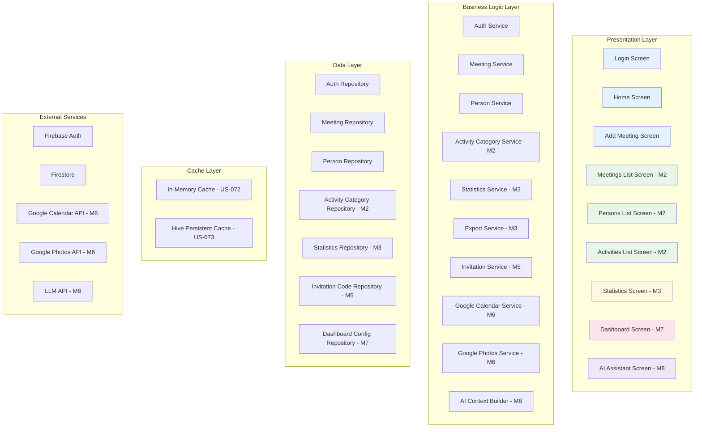
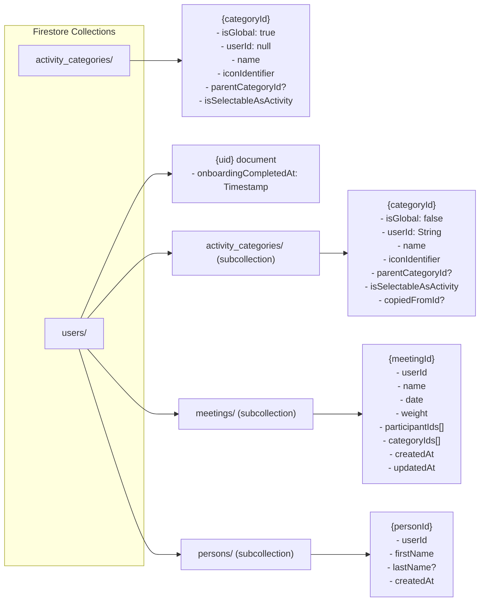
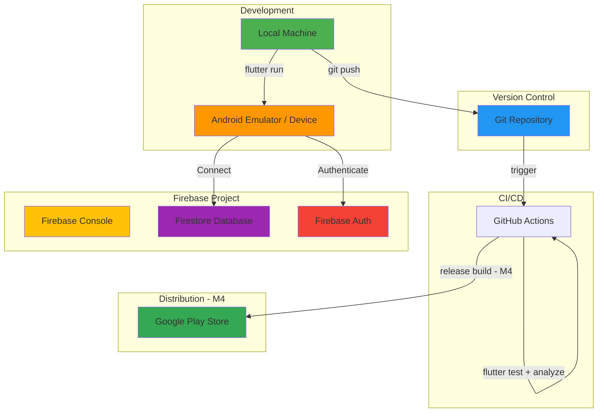

# Friendsheet - Architecture Documentation

## 1. Architecture Overview (High-Level)



**Responsible Role:** Solution Architect (SA)

---

## 2. Data Model - Entity Relationship Diagram (ERD)



**Responsible Role:** Solution Architect (SA) + Database Administrator (DBA)

---

## 3. Application Layer Architecture



**Architecture Pattern:** Clean Architecture / MVVM  
**Responsible Role:** Solution Architect (SA) + Tech Lead

---

## 4. Milestone Architecture Notes

### M2 — Navigation Architecture (US-021)

**Primary navigation pattern:** `BottomNavigationBar` with 4 tabs hosted in `MainScreen`.

**MainScreen** is the root widget returned by `AuthWrapper` after successful authentication. It owns the `BottomNavigationBar` and global FAB.

**Tab structure:**
| Index | Label | Screen | Status |
|-------|-------|--------|--------|
| 0 | Home | HomeScreen | ✅ US-065 |
| 1 | Meetings | MeetingsListScreen | ✅ US-021 |
| 2 | Friends | PersonsListScreen | ✅ US-024 |
| 3 | Activities | ActivitiesListScreen | ✅ US-026 |

**IndexedStack:** All tab widgets are kept alive — `MeetingsListScreen` stream subscription stays active when switching tabs.

**FAB:** Global `FloatingActionButton` in `MainScreen` navigates to `AddMeetingScreen` from any tab. After save, `Navigator.pop()` returns to originating tab.

**MeetingsListProvider pattern:**
- Extends `ChangeNotifier`
- Owns `StreamSubscription<List<Meeting>>` — cancelled in `dispose()`
- Groups meetings client-side by year (`Map<int, List<Meeting>>`)
- Auto-expands current year and previous year on `initialize()`

**Firestore indexes** managed via `firestore.indexes.json` (committed to repo). Deploy with:
```bash
firebase deploy --only firestore:indexes
```

---

### M2 — Activity Category Hierarchy

Activity categories support up to **2 levels** of nesting via `parentCategoryId`.
Users start with a copy of global categories (seeded during onboarding — US-020).
After onboarding, users see and manage only their own private categories.
```
Sport (level 1, isGlobal: false, userId: uid)
└── Tennis (level 2, isGlobal: false, userId: uid)

Food & Drinks (level 1, isGlobal: false, userId: uid)
└── Restaurant (level 2, isGlobal: false, userId: uid)
```

**Firestore path:** `users/{userId}/activity_categories` (subcollection)
Depth validation enforced in `ActivityCategoryRepository._validateDepth()`.

**Icon System:** PNG asset icons stored as string identifiers (e.g. `"sports_tennis"`) referencing a predefined set of 51 custom icons in `assets/icons/activities/`. Identifier resolved to asset path via `resolveActivityIcon()` helper in `activity_icons.dart`. Falls back to `Icons.category` if identifier unknown.

**Statistics implication:** Filtering by parent category includes all descendants. Query logic: load full category tree client-side, resolve descendant IDs, filter meetings.

**Onboarding copy logic:** On first login, all global categories are batch-copied to user's subcollection (US-020). Global categories are invisible to the user after onboarding.

---

### M2 — Activities List Screen (US-026)

**ActivitiesListProvider** owned by `MainScreen` — same lifecycle pattern as `PersonsListProvider`.
Initialized via `addPostFrameCallback` on first load and re-initialized on every tab switch to index 3.

**Data source:** `getAllCategories` reads only from `users/{userId}/activity_categories` subcollection. Root `activity_categories` collection is used only by `AuthService` during onboarding batch-copy — never queried from the UI layer.

**Edit/Delete guard:** Only categories with `isGlobal: false` expose long-press options.
Global categories are read-only in the UI.

---

### M3 — Statistics Architecture

Statistics are computed **client-side** in MVP (no Cloud Functions). This is acceptable for personal use scale (~800–5000 meetings).

**Performance consideration:** If queries become slow (>2s), introduce:
1. Composite Firestore indexes (isGlobal + categoryId)
2. Aggregation cache document updated on each meeting save
3. Cloud Functions for heavy computation (post-MVP upgrade path)

**ExportService** (`lib/data/services/export_service.dart`): fetches meetings,
persons and activityCategories for the authenticated user, serializes to JSON
and writes to `getExternalStorageDirectory()` (null-safe fallback to
`getApplicationDocumentsDirectory()`). Injectable `directoryProvider` parameter
enables test isolation without mocking platform channels.

**StatisticsRepository:** Separate from MeetingRepository. Dedicated queries:
- `getAvailableYears(userId)` — extracts unique years from meeting dates, sorted descending
- `getMeetingsForYear(userId, year)` — date-range query (Jan 1 → Jan 1 next year)

**StatisticsProvider:** Owned by `MainScreen` — same lifecycle pattern as `ActivitiesListProvider`.
Initialized via `addPostFrameCallback` on tab switch to index 0.
Persists `selectedYear` and `availableYears` during session.
`initialize()` is idempotent — guarded against concurrent calls.

**YearStepper:** Pure `StatelessWidget`. Receives `selectedYear`, `availableYears`, `onYearChanged` via constructor. No provider knowledge inside widget. Supports both arrow tap and swipe gesture.

**UI Decision:** Year selector implemented as YearStepper (`← YYYY →`) with horizontal swipe support. Arrows disabled at year boundaries.

**StatisticsRepository methods:**
- `getAvailableYears(userId)` — extracts unique years from meeting dates, sorted descending
- `getMeetingsForYear(userId, year)` — date-range query (Jan 1 → Jan 1 next year)
- `getActivityWeightBreakdown(userId, year)` — ancestor-aware weight aggregation per categoryId (US-028)
- `getPersonsForActivity(activityId, year, userId)` — weight per person for selected activity (US-029)
- `getInteractionDistribution(year, userId)` — yearly weight sum per person, two-year comparison (US-030)
- `getCumulativeInteractions(year, userId)` — cumulative weight sum per person up to selected year (US-030)

**Animated bar chart pattern (US-048, US-049):**
Use `_lastTargetLeft` / `_lastTargetBarHeight` fields (not `evaluate(controller)`) as tween begin values in `didUpdateWidget`. This guarantees stationary bars have `begin == end` regardless of controller timing or number of `didUpdateWidget` calls.

---

### M4 — Production Build

**Status:** Signing config implemented (US-042)

**Keystore management:**
- Keystore file: stored outside project directory, never committed
- Location convention: one level above project root
- `key.properties`: gitignored, contains absolute keystore path and passwords
- `android/app/build.gradle.kts`: signing config loaded from key.properties (Kotlin DSL)
- CI/CD: keystore provided via GitHub Secrets for automated release builds (planned)

**New gitignore entries added:**
```
*.jks
*.keystore
key.properties
android/key.properties
```

---

### M5 — Social Data Sharing (Copy-Based, Option A)

**Decision:** Copy-based sharing chosen over real-time shared documents.

**Rationale:**
- Maintains existing data isolation model (no architectural changes to core)
- No Firestore cost risk from shared real-time listeners
- No conflict resolution logic needed
- Upgrade path to real-time sharing (Option B) possible without full rewrite

**Trade-off:** Data diverges after sharing. Person A editing a meeting after sharing will NOT update Person B's copy.

**Flow:**
```
Person A generates code
    → Firestore: invitation_codes/{code} created (TTL: 48h)
    
Person B redeems code
    → Validate: exists, not expired, not used
    → Query: meetings where participantIds contains targetPersonId
    → Batch write: copy meetings + persons + activities to B's Firestore
    → Deduplication: match persons/activities by name before creating new docs
    → Mark code as used
```

**New Firestore collection:** `invitation_codes`

```javascript
match /invitation_codes/{codeId} {
  // Anyone authenticated can read (needed to validate code)
  allow read: if isAuthenticated();
  // Only sender can create
  allow create: if isAuthenticated() && isOwner(request.resource.data.senderId);
  // Only recipient can update status to 'used'
  allow update: if isAuthenticated();
}
```

---

### M6 — Meeting Import Hub

**Overview:** M6 introduces an extensible import system. Both import sources (Google Calendar and Google Photos) produce a list of `ImportCandidate` objects that flow into a shared, source-agnostic `MeetingInboxScreen`. This design allows new import sources to be added in future milestones by implementing only a new data-fetching layer — the inbox requires no changes.

**Import flow:**
```
External Source → ImportCandidate list (local memory) → MeetingInboxScreen → Firestore
```

**ImportCandidate model (local only — NOT persisted to Firestore):**
```dart
class ImportCandidate {
  final String id;          // local UUID, session-only
  final String title;       // pre-filled from event title (empty for photos)
  final DateTime date;      // from event start date or photo creation date
  final List<String> attendeeEmails;  // Calendar only; empty for Photos
  final ImportSourceType sourceType;  // calendar | photos
}
```

**MeetingInboxProvider:** holds `List<ImportCandidate>` with `SharedPreferences` persistence
(key: `meeting_inbox_candidates`). Candidates survive app restarts. Cleared on
`ImportSuccessScreen` CTA tap via `provider.clear()`.

---

**FEATURE-013: Google Calendar Import**

OAuth Scope: `https://www.googleapis.com/auth/calendar.readonly`

Token management: stored via `flutter_secure_storage`. Separate from Firebase Auth token.

Settings stored in SharedPreferences:
- `calendar_selected_ids`: List of selected calendar IDs (default: primary)
- `calendar_include_all_day`: bool (default: false)

Event filtering rules:
- Past events only (startTime < now)
- Minimum 2 attendees (organizer + at least 1 other)
- ALL-DAY events: excluded by default, included if `calendar_include_all_day: true`

Email-to-person heuristic: `firstname.lastname@domain` → parsed as `firstName: "Firstname", lastName: "Lastname"` — shown as suggestion, never auto-created.

---

**FEATURE-014: Google Photos Import**

OAuth Scope: `https://www.googleapis.com/auth/photoslibrary.readonly`

Token management: same `flutter_secure_storage` service as Calendar.

Data flow: photo creation date → `ImportCandidate.date`. Photo thumbnails displayed in grid for selection UX only — never stored.

Shares `MeetingInboxScreen` and `MeetingInboxProvider` with FEATURE-013 — no duplication. `sourceType: photos` on ImportCandidate allows inbox UI to adapt (e.g. no email suggestions for photos).

---

### M7 — Dashboard Configuration

**Storage:** Dashboard config stored in Firestore at `users/{uid}/dashboard_config` as a single document containing ordered widget list.

**Widget architecture:** Each dashboard widget is a self-contained Flutter widget that accepts a `DashboardWidgetConfig` object. Widget library is extensible — new widget types added without changing dashboard infrastructure.

---

### M8 — AI Assistant

**Status:** Architecture pending spike (US-040).

**Options under evaluation:**
- Claude API / OpenAI API — cloud-based, per-token cost, high quality
- Gemini Nano on-device — zero marginal cost, limited capability, no privacy concerns

**Privacy principle:** Raw Firestore data never sent to LLM. Only aggregated statistics summary sent as context. User must explicitly consent before first use.

---

## 5. Firestore Data Structure



**Global vs Private data pattern:**
- Root `activity_categories/`: global template only (`isGlobal: true`, `userId: null`) — read-only for all users, managed via Firebase Console
- `users/{uid}/activity_categories/`: user's private copies (`isGlobal: false`, `userId: String`) — batch-copied from global on first login, fully editable by owner

**Rule:** Never query root `/meetings` or `/persons` — these collections do not exist post US-045.
All user data lives under `users/{uid}/` subcollections.

---

## 6. Security Rules (Full)

```javascript
rules_version = '2';
service cloud.firestore {
  match /databases/{database}/documents {

    function isAuthenticated() {
      return request.auth != null;
    }

    function isOwner(userId) {
      return request.auth.uid == userId;
    }

    match /activity_categories/{categoryId} {
      allow read: if isAuthenticated() && resource.data.isGlobal == true;
      allow create: if isAuthenticated() &&
                       request.resource.data.isGlobal == false &&
                       isOwner(request.resource.data.userId);
    }

    match /users/{userId} {
      allow read, write: if isAuthenticated() && isOwner(userId);
    }

    match /users/{userId}/activity_categories/{categoryId} {
      allow read, delete: if isAuthenticated() && isOwner(userId);
      allow create, update: if isAuthenticated() && isOwner(userId);
    }

    match /users/{userId}/meetings/{meetingId} {
      allow read, delete: if isAuthenticated() && isOwner(userId);
      allow create, update: if isAuthenticated() && isOwner(userId);
    }

    match /users/{userId}/persons/{personId} {
      allow read, delete: if isAuthenticated() && isOwner(userId);
      allow create, update: if isAuthenticated() && isOwner(userId);
    }

    match /invitation_codes/{codeId} {
      allow read: if isAuthenticated();
      allow create: if isAuthenticated() && isOwner(request.resource.data.senderId);
      allow update: if isAuthenticated();
    }

    match /users/{userId}/dashboard_config/{configId} {
      allow read, write: if isAuthenticated() && isOwner(userId);
    }
  }
}
```

---

## 7. Deployment Architecture



---

## 8. Technology Stack

### Current (M1)
- **Framework:** Flutter 3.0+ / Dart
- **State Management:** Provider
- **Database:** Cloud Firestore
- **Authentication:** Firebase Auth (Google Sign-In)
- **Models:** Freezed + json_serializable

### Planned Additions
| Milestone | Addition | Purpose |
|-----------|----------|---------|
| M2 | No new packages | Reuses existing stack |
| M3 | `path_provider`, `dart:io` ✅ | JSON export to device storage |
| M3.5 / US-072–073 | `hive`, `hive_flutter` ✅ | Persistent local cache for offline-first statistics |
| M4 | Release signing config | Production build |
| M5 | No new packages | Firestore batch writes |
| M6 (FEATURE-013) | `google_sign_in` (extended scope: `calendar.readonly`) ✅ | Calendar OAuth |
| M6 (FEATURE-013) | `flutter_secure_storage` ✅ | OAuth token storage |
| M6 (FEATURE-013) | Google Calendar REST API (via `http`) ✅ | Fetch calendar events |
| M6 (FEATURE-014) | `google_sign_in` (extended scope: `photoslibrary.readonly`) | Photos OAuth |
| M6 (FEATURE-014) | Google Photos REST API (via `http`) | Fetch photo metadata |
| M7 | No new packages | Reuses existing stack |
| M8 | HTTP client (already available), LLM SDK TBD | AI API calls |

---

## 9. Scalability Considerations

### Current (Personal Use Scale)
- Client-side statistics aggregation
- Simple queries by userId
- Firestore free tier sufficient

### Post-MVP Upgrade Path
- **Statistics:** Cloud Functions for server-side aggregation
- **Social features:** Real-time shared documents (Option B) if copy-based insufficient
- **Caching:** TTL-based Hive cache expiration (deferred — single user, infrequent writes)
- **Indexes:** Composite indexes for category + isGlobal queries

---

## Statistics Caching Strategy (US-072, US-073)

### Problem

Each `StatisticsProvider.initialize()` call previously triggered multiple redundant Firestore reads:
the same year's meetings, categories, and persons were fetched independently by each of
`getActivityWeightBreakdown`, `getPersonsForActivity`, and `getInteractionDistribution`.
Additionally, every app restart cleared all cached data and triggered ~1,800 Firestore reads
on first statistics open.

### Three-Phase Solution (US-072) + Persistent Layer (US-073)

**Phase 1 — Provider-level idempotency guard**

`StatisticsProvider` tracks `_isInitialized` and `_lastLoadedYear`. A second `initialize()` call
with the same year is a no-op. `selectYear()` with the same year is also a no-op. `resetCache()`
clears the guard for logout/user-switch scenarios.

**Phase 2 — Repository-level in-memory cache**

`StatisticsRepository` caches:
- `_meetingsCache: Map<String, List<Meeting>>` keyed by `'${userId}_${year}'`
- `_categoriesCache: List<ActivityCategory>?` (single user)
- `_personsCache: List<Person>?` (single user)

Cache invalidation is wired via the `CacheInvalidator` interface (implemented by
`StatisticsRepository`, consumed by `MeetingRepository`, `PersonRepository`,
and `ActivityCategoryRepository`). All `invalidate*Cache()` methods are `Future<void>` —
write operations `await` them so stale data is never served after a mutation.

**Phase 3 — Single-query refactor via StatsDataBundle**

`StatsDataBundle` (plain Dart class, no Freezed) bundles all data for one year's statistics:

```dart
class StatsDataBundle {
  final List<Meeting> currentYearMeetings;
  final List<Meeting> previousYearMeetings;
  final List<ActivityCategory> categories;
  final List<Person> persons;
}
```

`StatisticsRepository.loadAllStatsData(year, userId)` fetches all four in parallel via
`Future.wait`, using caches where available. The result is stored on `StatisticsProvider`
as `_currentBundle` and reused by:

- `computeActivityBreakdown(bundle)` — synchronous, no Firestore
- `computePersonsForActivity(bundle, categoryId)` — synchronous, no Firestore
- `computeInteractionDistribution(bundle)` — synchronous, no Firestore

`selectActivity()` and yearly-mode `loadDistribution()` use the stored bundle —
zero additional Firestore reads. Only cumulative mode (`getCumulativeInteractions`)
and `getAvailableYears` still require their own queries.

### Persistent Cache Layer (US-073)

**Problem:** In-memory cache (US-072) is cleared on every app restart, triggering
~1,800 Firestore reads on first statistics open after relaunch.

**Solution:** Hive persistent cache as a second cache layer below in-memory.

**Lookup chain:**
1. In-memory cache (US-072) — fastest, session-only
2. Hive disk cache (US-073) — fast, survives restarts
3. Firestore — only on true cache miss (first ever load)

**Hive box structure:**

| Box name | Key | Value |
|---|---|---|
| `stats_meetings` | `{userId}_{year}` | `List<Meeting>` as JSON |
| `stats_categories` | `{userId}` | `List<ActivityCategory>` as JSON |
| `stats_persons` | `{userId}` | `List<Person>` as JSON |
| `stats_available_years` | `{userId}` | `List<int>` |

**Adapter strategy: JSON bridge (Option B)**
Existing `toJson()`/`fromJson()` methods used for serialization.
No `@HiveType`/`@HiveField` annotations on Freezed models — avoids build_runner conflicts.

**HiveService** (`lib/services/hive_service.dart`): opens all boxes once at app startup
in `main.dart` before `runApp()`. `clearUserData(userId)` removes all cache entries
for a given user — called on logout from `AuthService`.

**Cache invalidation:** All `invalidate*Cache()` methods in `StatisticsRepository`
are `Future<void>` and clear both in-memory and Hive layers atomically.
`CacheInvalidator` interface methods are `Future<void>` accordingly.

### Combined Result

| Operation | Before US-072 | After US-072 | After US-073 |
|---|---|---|---|
| First initialize() | ~10+ queries | 1 (years) + 4 (bundle) | 1 (years) + 4 (bundle) |
| selectYear() (new year) | ~8 queries | 2 (cached) | ~0 (if Hive hit) |
| selectActivity() | 2 queries | 0 | 0 |
| loadDistribution() (yearly) | 3 queries | 0 | 0 |
| Second initialize() (same tab) | ~10+ | 0 (provider guard) | 0 |
| App restart, no writes | ~10+ | ~5 (cache cleared) | ~0 (Hive hit) |

---

### M5 — Calendar Import Architecture (US-065, US-066)

**HomeProvider** subscribes to `MeetingRepository.getMeetingsByUser()` stream —
same real-time listener pattern as `MeetingsListProvider`.

`shouldShowCta` getter: `_initialized && _meetingCount < 50`

The `_initialized` flag prevents CTA card flash on startup — `shouldShowCta` returns
`false` until the first stream emission sets `_initialized = true`. Before that,
`HomeScreen` renders `HomeLoadingScreen` with `assets/images/loading_icon.png`.

CTA card has **no dismiss button** — it disappears only when meeting count reaches 50.
(FR-020 final spec removed dismiss — `isDismissed` / `onboarding_calendar_cta_dismissed`
key no longer used.)

**GoogleCalendarService** (Singleton) uses incremental OAuth via `google_sign_in.requestScopes()`.
Access token stored in `flutter_secure_storage` (key: `google_calendar_access_token`).
Does NOT create a new GoogleSignIn instance — reuses existing session.

**CalendarSettingsProvider** owned by `MainScreen` — same lifecycle pattern as other providers.
Calendar selection and ALL-DAY preference persisted in SharedPreferences:
- `calendar_selected_ids` — JSON-encoded list
- `calendar_include_all_day` — bool (default: false)

**CalendarPermissionScreen** navigation:
- Entry: MainScreen Drawer → "Import from Calendar"
- On grant: `Navigator.pushReplacement` → SettingsScreen (calendar section visible)
- On deny: error message shown inline, retry available

**Token refresh:** `_withTokenRetry<T>` generic helper in `GoogleCalendarService`
wraps any API call with a single silent-refresh retry on `CalendarAuthException`.
Reuse this pattern for Google Photos (`fetchPhotos()`) in FEATURE-014.

---

### M5 — Meeting Inbox Architecture (US-068)

**MeetingInboxProvider** owned by `MainScreen` — same lifecycle as
`CalendarSettingsProvider`. Initialized via `loadFromPrefs()` in
`addPostFrameCallback`.

**Persistence:** `SharedPreferences` key `meeting_inbox_candidates` —
`List<ImportCandidate>` serialized as JSON. Candidates survive app restarts.
Cleared on `ImportSuccessScreen` CTA tap via `provider.clear()`.

**Navigation scope rule:** Every `Navigator.push` to `MeetingInboxScreen`
or `CalendarEventsScreen` must wrap the child in
`ChangeNotifierProvider.value(value: _meetingInboxProvider)` — new routes
do not inherit providers from `MainScreen` automatically.

**Source-agnostic design:** Both Calendar (US-067) and Photos (US-070)
call `addCandidates()` on the same `MeetingInboxProvider`. Adding a new
import source requires only a new data-fetching layer.

---

**End of Document - Architecture Documentation**

**Last Updated:** March 2026 (US-073 persistent Hive cache + HomeLoadingScreen added)