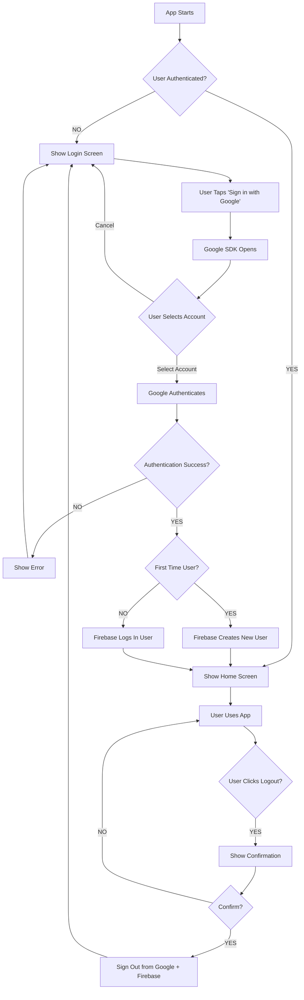

# Friendsheet - Wireframes & UI Documentation (UPDATED for Google SSO)

**Responsible Role:** UX/UI Designer  
**Version:** 1.1 (Updated for Google Sign-In)  
**Last Updated:** February 14, 2026

**🎯 Major Change:** Simplified authentication flow using Google Sign-In instead of email/password

---

## 🔄 Authentication Flow Comparison

### Before (Email/Password):
```
Login Screen ──→ Register Screen ──→ Forgot Password ──→ Email Verification ──→ Home
   ↓                                                                              ↑
   └──────────────────────────────────────────────────────────────────────────────┘
```

### After (Google Sign-In) - MUCH SIMPLER! ✨:
```
Login Screen ──→ [Google Sign-In] ──→ Home
      ↑                                   │
      └───────────────────────────────────┘
              (one tap logout)
```

**Reduction:** 3 screens → 1 screen (67% simpler!)

---

## Ekran 1: Login Screen with Google Sign-In (⚡ UPDATED)

```
┌─────────────────────────────────────┐
│          FRIENDSHEET                │
│     Track Your Social Life          │
│                                     │
│         [App Logo/Icon]             │
│                                     │
│      ┌─────────────────────────┐   │
│      │                         │   │
│      │   [  G  ] Sign in      │   │
│      │         with Google     │   │
│      │                         │   │
│      └─────────────────────────┘   │
│                                     │
│      One tap to get started! 🚀    │
│                                     │
│                                     │
│    By signing in, you agree to     │
│         our Terms of Service       │
│                                     │
└─────────────────────────────────────┘
```

**🎨 The Metaphor - The Universal Access Badge:**
Think of this screen as the reception desk at a modern office building. Instead of filling out a long registration form and getting a new badge, you just tap your existing company badge (Google account) and you're in! The building trusts your company's security system.

**Components:**
- **App Branding Area:**
  - Friendsheet logo/icon
  - Tagline: "Track Your Social Life"
  - Welcoming, friendly design
  
- **Primary Action Button:**
  - "Sign in with Google" button
  - Google's official button design (white background, Google logo, blue text)
  - Follows Google Sign-In brand guidelines
  - Large, easy to tap (minimum 48dp height)
  
- **Supporting Text:**
  - Encouraging message: "One tap to get started!"
  - Terms of Service link (legal requirement)

**Visual Hierarchy:**
1. Logo/Brand (draws attention)
2. Google Sign-In button (primary action - can't miss it!)
3. Supporting text (builds confidence)

**States:**

**State 1: Initial (Idle)**
```
┌─────────────────────────────────────┐
│      [  G  ] Sign in with Google   │  ← Button enabled, ready to tap
└─────────────────────────────────────┘
```

**State 2: Loading**
```
┌─────────────────────────────────────┐
│      [ ⟳ ] Signing in...           │  ← Spinner animation
└─────────────────────────────────────┘
```

**State 3: Google Account Picker (OS-level)**
```
┌─────────────────────────────────────┐
│  Choose an account to continue to   │
│          Friendsheet                │
│                                     │
│  ┌───────────────────────────────┐ │
│  │ 👤 john.doe@gmail.com         │ │
│  │    John Doe                   │ │
│  └───────────────────────────────┘ │
│                                     │
│  ┌───────────────────────────────┐ │
│  │ 👤 jane.smith@gmail.com       │ │
│  │    Jane Smith                 │ │
│  └───────────────────────────────┘ │
│                                     │
│  [Use another account]              │
└─────────────────────────────────────┘
```
*Note: This is Google's native picker, not your custom screen!*

**State 4: Error**
```
┌─────────────────────────────────────┐
│   ⚠️ Sign in failed                │
│   Please try again or check your   │
│   internet connection              │
│                                     │
│      [  G  ] Try Again             │
└─────────────────────────────────────┘
```

**Acceptance Criteria:**
- ✅ Google Sign-In button follows Google's brand guidelines
- ✅ Button is prominent and easy to find
- ✅ Loading state provides feedback
- ✅ Error messages are helpful and friendly
- ✅ Works on first launch (no existing account needed)
- ✅ Accessible (proper contrast, touch target size)

**Design Specifications:**
- **Button Dimensions:** Full width - 32dp padding, min height 48dp
- **Google Logo:** Official Google "G" logo (provided by SDK)
- **Colors:** 
  - Button background: White (#FFFFFF)
  - Button text: Google Blue (#4285F4) or black (#000000) per guidelines
  - Button border: Light gray (#DADCE0)
- **Typography:** 
  - Button text: Roboto Medium, 14sp
  - Tagline: Roboto Regular, 16sp
  - Supporting text: Roboto Regular, 12sp

**Why This Design Works:**
1. **Familiar:** Users recognize Google's button instantly
2. **Trustworthy:** Google brand inspires confidence
3. **Simple:** No form fields, no password management
4. **Fast:** One tap to authenticate
5. **Accessible:** Clear, high contrast, large touch target

---

## ~~Ekran 2: Register Screen~~ [REMOVED - NOT NEEDED WITH GOOGLE SIGN-IN! 🎉]

**Status:** ❌ Obsolete  
**Reason:** Google Sign-In automatically handles registration  

**🎨 The Magic of SSO:**
With Google Sign-In, there's NO separate registration! The first time a user signs in with Google, Firebase automatically creates their account. It's like having a universal key card - first time you use it at a new building, it just works!

**What Happens Under the Hood:**
```
First-time user taps "Sign in with Google"
   ↓
Google authenticates the user
   ↓
Firebase receives the authentication
   ↓
Firebase checks: "Is this user in my database?"
   ↓
NO → Firebase automatically creates new user account
YES → Firebase logs in existing user
   ↓
User goes to Home screen
```

**Time Saved:** No registration screen to design, build, or test!

---

## Main App Screen: Home with Logout

```
┌─────────────────────────────────────┐
│  FRIENDSHEET                    ⋮   │← Menu icon
├─────────────────────────────────────┤
│                                     │
│  Welcome back, John! 👋             │
│  john.doe@gmail.com                 │
│                                     │
│  [+ ADD NEW MEETING]                │
│                                     │
│  Your recent meetings               │
│  (Future feature - not in MVP)      │
│                                     │
│                                     │
│                                     │
└─────────────────────────────────────┘
```

**Tapping menu (⋮) opens drawer:**

```
┌─────────────────────────────────────┐
│ FRIENDSHEET                         │
├─────────────────────────────────────┤
│                                     │
│  👤 John Doe                        │
│     john.doe@gmail.com              │
│                                     │
├─────────────────────────────────────┤
│                                     │
│  🏠 Home                            │
│  📊 Statistics (Coming Soon)        │
│  ⚙️  Settings (Coming Soon)         │
│                                     │
│  ──────────────────────                │
│                                     │
│  🚪 Log Out                         │
│                                     │
└─────────────────────────────────────┘
```

**Logout Confirmation Dialog:**

```
┌─────────────────────────────────────┐
│          LOG OUT?              [X]  │
├─────────────────────────────────────┤
│                                     │
│  Are you sure you want to log out?  │
│                                     │
│  You'll need to sign in again to    │
│  access your meetings.              │
│                                     │
│     [CANCEL]      [LOG OUT]        │
│                                     │
└─────────────────────────────────────┘
```

---

## Screen 3: Add Meeting Screen (UNCHANGED)

```
┌─────────────────────────────────────┐
│  ← ADD MEETING                      │
├─────────────────────────────────────┤
│                                     │
│  Meeting Name *                     │
│  ┌─────────────────────────────┐   │
│  │ e.g., Coffee with Anna      │   │
│  └─────────────────────────────┘   │
│  0/50                               │
│                                     │
│  Meeting Date *                     │
│  ┌──────────────────┐  📅          │
│  │  02/12/2026      │  [Calendar]  │
│  └──────────────────┘              │
│                                     │
│  Meeting Weight *                   │
│  ┌──────────────────────────────┐  │
│  │   [-]    8    [+]            │  │
│  └──────────────────────────────┘  │
│  (1, 2, 3, 5, 8, 13, 21)           │
│                                     │
│  Participants * (min. 1)           │
│  ┌─────────────────────────────┐   │
│  │ 🔍 Type name...             │   │
│  └─────────────────────────────┘   │
│  ┌───────────────────────────────┐ │
│  │ [x] Anna Smith               │ │
│  │ [x] John Doe                 │ │
│  └───────────────────────────────┘ │
│                                     │
│  Activities * (min. 1)             │
│  ┌─────────────────────────────┐   │
│  │ 🔍 Add activity...          │   │
│  └─────────────────────────────┘   │
│  ┌───────────────────────────────┐ │
│  │ [x] Coffee ☕                 │ │
│  │ [x] Walking 🚶               │ │
│  └───────────────────────────────┘ │
│                                     │
│  ┌─────────────────────────────────┐│
│  │       SAVE MEETING              ││
│  └─────────────────────────────────┘│
│                                     │
└─────────────────────────────────────┘
```

*This screen remains the same - no changes needed for authentication method!*

---

## User Flow - Complete Authentication Journey



**🎨 The Journey Metaphor:**

Think of authentication like entering a members-only club:

1. **App Starts** = You arrive at the club entrance
2. **Check Authentication** = Bouncer checks if you have a valid membership
3. **Not Authenticated** = You need to show ID
4. **Tap Google Sign-In** = You show your universal membership card (Google)
5. **Google Authenticates** = The card scanner verifies it's real
6. **First Time?** = If new, they create your club profile automatically
7. **Enter App** = Welcome inside!
8. **Logout** = You return your access badge when leaving

---

## Comparison: Before vs. After

### UI Screens Count:
| Flow | Before (Email/Password) | After (Google SSO) | Reduction |
|------|------------------------|-------------------|-----------|
| Registration | Register Screen | ❌ Not needed | -1 screen |
| Login | Login Screen | Login Screen | Same |
| Forgot Password | Forgot Password Screen | ❌ Not needed | -1 screen |
| Email Verification | Verification Screen | ❌ Not needed | -1 screen |
| **Total Auth Screens** | **4 screens** | **1 screen** | **-75%!** |

### User Steps to First Use:
| Flow | Before (Email/Password) | After (Google SSO) |
|------|------------------------|-------------------|
| First Time User | 1. Enter email<br>2. Enter password<br>3. Confirm password<br>4. Submit<br>5. Wait for email<br>6. Open email<br>7. Click verification link<br>8. Return to app<br>**8 steps!** 😰 | 1. Tap "Sign in with Google"<br>2. Select account<br>**2 steps!** 🎉 |
| Returning User | 1. Enter email<br>2. Enter password<br>3. Submit<br>**3 steps** | 1. Tap "Sign in with Google"<br>2. Select account<br>**2 steps** |

### Development Effort:
| Component | Before | After | Saved |
|-----------|--------|-------|-------|
| Screens | 4 | 1 | 3 screens |
| Form Validations | Email, password, matching passwords | None! | All validations |
| Error Handling | Email exists, weak password, network, verification | Just network & cancel | Simpler |
| Email Service | Need email verification system | None! | Complete service |
| Password Reset | Entire flow needed | None! | Entire feature |

---

## Accessibility Considerations (UPDATED)

### WCAG 2.1 Compliance for Login Screen:
- **Color Contrast:** Google button meets 4.5:1 minimum
- **Touch Targets:** Button is 48dp+ height (exceeds 44dp minimum)
- **Text Size:** 14sp button text (exceeds 12sp minimum)
- **Focus Indicators:** Google button has clear focus state
- **Screen Reader:** Button announced as "Sign in with Google button"

### Additional Accessibility Features:
- High contrast mode support
- Dynamic text sizing support
- VoiceOver/TalkBack compatible
- Keyboard navigation support (for future web version)

---

## Animation & Transitions (SIMPLIFIED)

### Login Flow:
1. **Button Press:** Ripple effect (Material Design) - 200ms
2. **Loading State:** Fade in spinner - 150ms
3. **Success:** Slide to home screen - 300ms
4. **Error:** Shake animation + fade in error - 250ms

**Note:** Google account picker is handled by OS - we don't control its animations

---

## Error States (SIMPLIFIED)

### Possible Errors:

**1. Network Error:**
```
┌─────────────────────────────────────┐
│   ⚠️ No Internet Connection        │
│   Please check your connection     │
│   and try again                    │
│                                     │
│      [  G  ] Try Again             │
└─────────────────────────────────────┘
```

**2. User Cancellation:**
```
┌─────────────────────────────────────┐
│   Sign in cancelled                 │
│   Tap the button to try again       │
│                                     │
│      [  G  ] Sign in with Google   │
└─────────────────────────────────────┘
```

**3. Google Play Services Error:**
```
┌─────────────────────────────────────┐
│   ⚠️ Google Play Services Required │
│   Please update Google Play         │
│   Services to continue             │
│                                     │
│      [Open Play Store]             │
└─────────────────────────────────────┘
```

**4. Generic Error:**
```
┌─────────────────────────────────────┐
│   ⚠️ Sign in failed                │
│   Something went wrong.            │
│   Please try again                 │
│                                     │
│      [  G  ] Try Again             │
└─────────────────────────────────────┘
```

**Much simpler than before!** No more "email already exists", "weak password", "passwords don't match" errors!

---

## Design Assets Needed

### For Login Screen:
- ✅ Friendsheet logo (SVG + PNG @1x, @2x, @3x)
- ✅ Google Sign-In button (provided by `google_sign_in` package)
- ✅ App icon
- ✅ Splash screen background

### Color Palette (Unchanged):
- **Primary Color:** #4CAF50 (Green)
- **Secondary Color:** #2196F3 (Blue)
- **Error Color:** #F44336 (Red)
- **Background:** #FFFFFF (White)
- **Text Primary:** #212121 (Dark Gray)

### Typography (Unchanged):
- **Font:** Roboto (Material Design standard)
- **Headings:** Roboto Medium
- **Body:** Roboto Regular
- **Buttons:** Roboto Medium

---

## Developer Handoff Notes

### What Changed:
1. **Removed Screens:**
   - ❌ Register Screen
   - ❌ Forgot Password Screen
   - ❌ Email Verification Screen

2. **Simplified Screens:**
   - ✅ Login Screen (just Google button + branding)
   - ✅ Home Screen (added logout in drawer)

3. **New Requirements:**
   - Must use official Google Sign-In button
   - Must follow Google's brand guidelines
   - Must handle Google Play Services errors

### Implementation Priority:
1. **High:** Login with Google Sign-In
2. **High:** Logout functionality
3. **Medium:** Error handling
4. **Low:** Confirmation dialogs (nice to have)

---

## Testing Scenarios (SIMPLIFIED!)

### Login Tests:
- ✅ First-time user can sign in and account is created
- ✅ Returning user can sign in
- ✅ User can cancel sign-in
- ✅ Network error is handled gracefully
- ✅ Google Play Services error is handled
- ✅ Loading state is shown during authentication
- ✅ User is redirected to home after success

### Logout Tests:
- ✅ User can access logout option
- ✅ Confirmation dialog appears (if implemented)
- ✅ User is signed out from both Google and Firebase
- ✅ User is redirected to login screen
- ✅ Cannot access protected screens after logout

**Previous test count:** ~15 test cases (email/password)  
**New test count:** ~11 test cases (Google SSO)  
**Reduction:** 27% fewer tests! 🎉

---

## 📊 Summary of Changes

### Before (Email/Password):
- 4 authentication screens
- 15+ test cases
- 8 steps for first-time users
- Complex form validations
- Email verification system needed
- Password reset flow needed

### After (Google Sign-In):
- 1 authentication screen ✨
- 11 test cases ✨
- 2 steps for first-time users ✨
- No form validations ✨
- No email verification ✨
- No password reset ✨

### Benefits:
- ⏱️ **Faster to build:** -75% screens
- 😊 **Better UX:** -75% user friction
- 🔒 **More secure:** Google's infrastructure
- 🧪 **Easier to test:** Fewer edge cases
- 💼 **More professional:** Industry standard

---

**End of Updated Wireframes Documentation**

**Next Step:** Implement US-004 (Google Sign-In) following this design! 🚀
